# Fresh Pasta Exercise

This is a simple HTML project that demonstrates a recipe page for making fresh pasta.  
It is created as part of a beginner HTML learning exercise, with no CSS styling applied.

## Project Structure

- **index.html** – The main HTML page containing the recipe content.
- **images/** – Folder containing images used in the recipe.

## Features

- Basic HTML tags (headings, paragraphs, lists, images).
- Recipe instructions for making fresh pasta.
- Semantic HTML structure for better readability.

## How to Open

1. Download the project files.
2. Open `index.html` in any web browser.

## Purpose

This project is made for learning HTML only — **no CSS** is used so that the focus remains on HTML elements and structure.

# Chapter 4 – Working With Forms

This chapter has 7 topics and 1 exercise.

## Topic 1 – Creating Text Input & Buttons

1. This is simple using HTML tags. For example, if I have to create a text input:

```<input type="text"> ```
REMEMBER: The input tag does not have a closing tag.

This code makes a simple rectangle where we can put text.

And then I learned about making buttons using the <button> tag:

text
```<button>Press Me</button>```
This makes a button named Press Me.

AND SIR GAVE US THIS TAG FOR BUTTONS:

text
```<button type="button">Press Me</button>```
But lastly, he told us we don’t need to write the (type) attribute in the button tag — it’s not important.

Topic 2 – The Form Element
We learned about the form element. The form element sends our data somewhere.
Example:

text
```<form>```
   ```<input type="text">```
   ```<button>Send</button>```
```</form>```
Here, it makes an input text box and a button inside the form element, meaning when we press the button, the form element sends our data (which we put in the input text box).

BUT WHERE DOES IT SEND OUR DATA?

We read about one attribute of the form element called (action):

text
```<form action="login">```
   ```<input type="text">```
   ```<button>Send</button>```
```</form>```
Here, the action attribute in the form element tells the form where to send data. For example, if we have a login page in the backend, we can set the action to "login", and the form will send data to the login page.

We can put anything in the action attribute, e.g.:

text
```<form action="https://google.com">```
   ```<input type="text">```
   ```<button>Search</button>```
```</form>```
Here, the action tells the form element to send data to Google.com.

And sir told us about method="get" which specifies how to send data — but he said we would learn it later.

## Topic 3 – Name and Placeholder Attributes

In the input tag, putting the name attribute gives a name to the value you enter:

text
```<form action="https://google.com">```
   ```<input name="username">```
   ```<button>Send</button>```
```</form>```
When the user puts data in the text input and presses the button, the browser will redirect to Google with the query parameter like:
google.com/?username=(what you typed)

Placeholder Attribute

It’s like a visual hint inside the input box. When you start typing, it disappears.

text
```<input placeholder="First Name">```
Here, “First Name” is shown until you type something.

Note: Attributes like (type), (name), (placeholder) should be written in the input element.

Topic 4 – Label
The ```<label>``` tag is used to give a label to a text input box.

text
```<label>Type Name</label>```
```<input type="text">```
This shows a text input box with the label Type Name, but clicking the label does nothing.

To make the label clickable:

text
```<label for="name">Type Name</label>```
```<input id="name" type="text">```
Now, when you click the label, the cursor automatically goes to the text box with the matching id.

## Topic 5 – Different Types of Inputs
There are many types of inputs:

type="number" (only numbers)

type="password" (hides characters)

type="color" (color picker)

type="date" (date picker)

type="email" (requires a valid email format)

required forces the field to be filled before submission — added directly to ```<input>```.

Topic 6 – Checkbox, Textareas, and Range Inputs
Textarea – Multi-line text box.

text
```<textarea></textarea>```
Range – A slider.

text
```<input type="range" min="0" max="10" step="1">```
min, max, and step control slider limits.

Checkbox

text
```<input type="checkbox" id="check">```
```<label for="check">Check Me</label>```
Clicking the label toggles the checkbox.

Topic 7 – Select and Radio Button
Select Dropdown

text
```<select name="options">```
   ```<option value="opt1">Option 1</option>```
   ```<option value="opt2">Option 2</option>```
   ```<option value="opt3">Option 3</option>```
```</select>```
The value in each ```<option>``` is what gets sent when the form is submitted.

Radio Buttons

text
```<input type="radio" name="choice" value="A">```
```<input type="radio" name="choice" value="B"> ```
Radio buttons allow selecting only one option per name group.

## chapter 5 other elements

## topic one ```<spans>```
- spans are generic inline elements. they have no special
- meaning but can be use later in styling in css.
- like i give u example
``` <p>hey i love my <span>cats </span> and i love my cars</p>```
    - here i put cats in between span and if u run the code nothing 
    - is gonna happen but when we enter in css we can change colour, style ,etc etc 
    - of the thing which is between in span.

## topic 2 ```<div>```
- A div can be used to group some things together, e.g.,
```<div>```
```<p>Hey, I love my <span>cats</span> and I love my cars</p>```
```<h1>Come learn HTML and CSS with us</h1>```
```<h2>Let's start with elements</h2>```
```<p>Hello, we are all going to read about elements now in HTML, and```
```after that, we will also learn CSS.</p>```
```</div>```

** Here, we wrote a heading and a paragraph and closed all of them inside a div element. When we run the code, we see the headings and paragraphs, but when we learn CSS, we can style that part alone. For example, we can put the code in a div and then style this part separately in CSS. We can style this entire section of code all at once. **

## topic 3 ```<table>```
- table is the element use use to make the tables
in table element we have to put ```<tr>``` element which tells table element that i am making rows in table now
- then to make rows we have to put ```<td>``` element eg.
```
        <table>
            <tr>
                <td>item</td>
                <td>price</td>
                <td>colour</td>
                <td>benefits</td>
            </tr>
            <tr>
                <td>black chocolate</td>
                <td>$2.12</td>
                <td>black</td>
                <td>instant energy</td>
            </tr>
            <tr>
                <td>cold cofee</td>
                <td>$1.34</td>
                <td>grey</td>
                <td>keep mind focus</td>
            </tr>
            <tr>
                <td>green tea</td>
                <td>$0.98</td>
                <td>transparent</td>
                <td>reduces cholestrol</td>
            </tr>
        </table>
```
- we get this result....
        item	   price	 colour	     benefits
black chocolate  $2.12   black	      instant energy
cold cofee	    $1.34 	 grey	        keep mind focus
green tea	     $0.98	 transparent	reduces cholestrol

- but did u see that we put all in ```<td>``` and got same result 
-   even our heading looks same as our content in the table (items,price,colour,benefits)
- also looks same but to make it like as heading put```<th>``` instead of ```<td>```
- only put headings in ```<th>``` eg.
```
  <table>
            <tr>
                <th>item</th>
                <th>price</th>
                <th>colour</th>
                <th>benefits</th>
            </tr>
            <tr>
                <td>black chocolate</td>
                <td>$2.12</td>
                <td>black</td>
                <td>instant energy</td>
            </tr>
            <tr>
                <td>cold cofee</td>
                <td>$1.34</td>
                <td>grey</td>
                <td>keep mind focus</td>
            </tr>
            <tr>
                <td>green tea</td>
                <td>$0.98</td>
                <td>transparent</td>
                <td>reduces cholestrol</td>
            </tr>
        </table>
    
    
</body>
</html>
```
- her we got this in result...
**item**	       **price**	**colour**	 **benefits**
black chocolate	$2.12	     black	      instant energy
cold cofee	      $1.34	     grey	       keep mind focus
green tea	      $0.98	     transparent	 reduces cholestrol

- did u see we got heading in bold letters due to ```<th>``` so from now on when we have to make heading rows in table we use ```<th>``` and for normal rows we use ```<td>```

- also put table heading in ```<thead>``` just like we put ```<head>``` in simple html code
- it cant do anything but just to easy to understand the code to coder and made code stylish and to style in css and perfect code structure eg.  
```
<table>
 <thead>
            <tr>
                <th>item</th>
                <th>price</th>
                <th>colour</th>
                <th>benefits</th>
            </tr>
            </thead>
```
- and thead should be placed inside table

- and put table body i mean(table rows) inside ```<tbody>```this also cant do anything but easy for coders to understand and for perfect code structure eg. 
```
</tbody>
            <tr>
                <td>black chocolate</td>
                <td>$2.12</td>
                <td>black</td>
                <td>instant energy</td>
            </tr>
            <tr>
                <td>cold cofee</td>
                <td>$1.34</td>
                <td>grey</td>
                <td>keep mind focus</td>
            </tr>
            <tr>
                <td>green tea</td>
                <td>$0.98</td>
                <td>transparent</td>
                <td>reduces cholestrol</td>
            </tr>
            </tbody>
        </table>
```
## semantic markup
** semantic elements all work like ```<div>``` but give meaning to the code eg this part of code is what part of code **

- semantic elements cant do anything new but provide meaning to our code(content)
- eg. we can put div but if we put main in place of div coder can understand eassily that this is the main part of the body also screen reader can know this is the main part of the body like i will give u example.
```
 <div>
            <p>Lorem, ipsum dolor sit amet consectetur adipisicing elit. Et delectus voluptatem labore commodi. Aliquam, aliquid similique. Non libero minus, nostrum labore explicabo dolore quod vero beatae, facilis, fugit mollitia earum!</p>
        </div>
```
- lets assume this is our main body in the code.
- we write code here with div and div make it seperate and when we have a very big code 
- and we fill it div coder and screen reader(inspect) got confuse what part is this
- like in the below pic

   

   - but if we write this same code with ```<main>``` tag
   - nothing gonna change main did same as div (seperates it) but 
   - when any other coder or screen reader(inspect) checks it
   - he says ohhh this is main body of the page.. eg..
```   
 <main>
            <p>Lorem, ipsum dolor sit amet consectetur adipisicing elit. Et delectus voluptatem labore commodi. Aliquam, aliquid similique. Non libero minus, nostrum labore explicabo dolore quod vero beatae, facilis, fugit mollitia earum!</p>
 </main>
```
 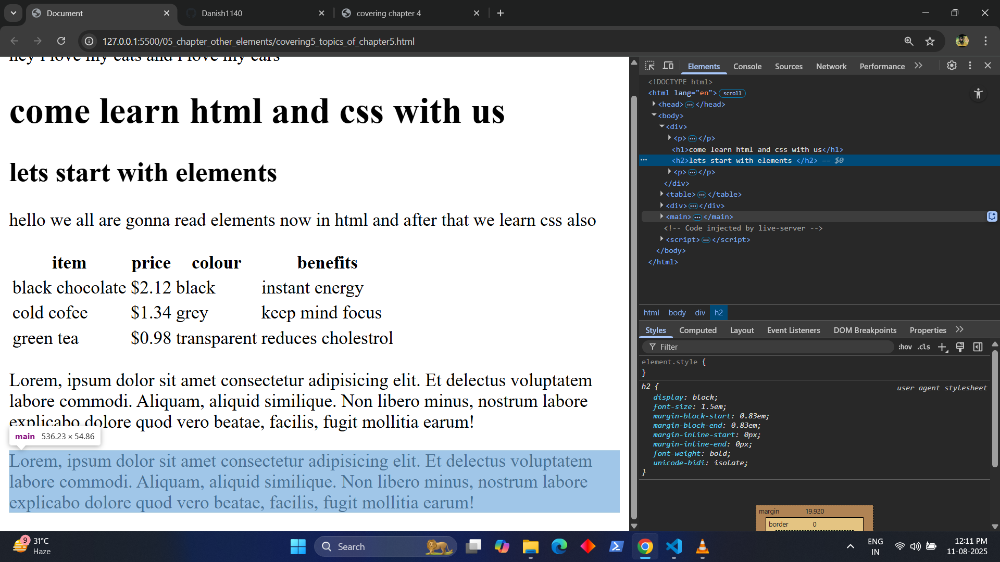


- same as ```<header>``` cant do anything same as ```<div>``` but told screen reader this is the heading
```
<h1>lorem episum</h1>
        <header>lorem episum story</header>

```
- same as ```<footer>``` can do anything same as div but told the screen reader this is footer ( in footer we wrote mainly the contact detalis and other thing like feedback etc etc)
- hey we can write anything in this but mainly foot of the webpage to ease the coder that this is foot of the page. 
```
 <footer>copyright no one 2025</footer>
```
- same as ```<nav>``` do nothing same as div but tell us this part is navigation part
- navigation(means this part contains links to another page) easy for coder or screen reader(inspect) eg. 
```
<nav>
            <ul>
                <li><a href="https://google.com">google</a></li>
                <li><a href="https://facebook.com">facebook</a></li>
            </ul>
        </nav>
```
- dont do anything here just tell this part is navigation part(contain links to another page).

- same as ```<aside>``` aside (means something thats tells coder or screen reader little bit about main content of the page) works same as div we know that .

- same as ```<time>``` tells coder or screen reader that in this part we put info. about time releated. eg.
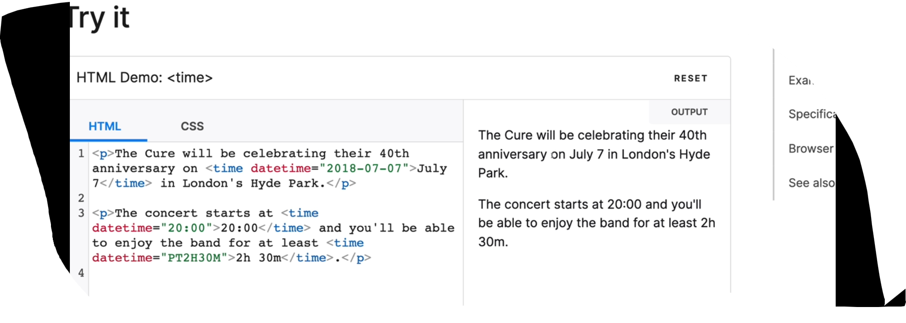

- same as ```<summary>``` tells coder or screen reader that part contains summary

* in short sematic elements tells coder or screen reader wha this part contains *


## chapter 6 basic css

# inline style
- basically in inline style we can style only one thing it can be anything paragraph div etc etc mens in that line we put that style (in the line we put attributioj style and then we can style that one particular thing) eg.

```
    <h1 style="color: brown;">THE LEGENDARY AK-47</h1>
    <p style="color:gold;">
        The <a href="https://www.istockphoto.com/photos/ak-47">AK-47</a>, officially known as the Avtomat Kalashnikova, is one of the most iconic and widely used assault rifles in the world. It was developed in the <a href="https://en.wikipedia.org/wiki/Soviet_Union">Soviet Union</a> by  <a href="https://www.gettyimages.in/photos/mikhail-kalashnikov">Mikhail Kalashnikov</a> and officially adopted by the Red Army in 1949. Renowned for its durability, simplicity, and low production cost, the AK-47 has become a symbol of both military power and revolutionary struggle. Its gas-operated, 7.62×39mm cartridge system allows it to function reliably in harsh conditions, including mud, sand, and extreme temperatures.The rifle can be operated with minimal training, which has made it especially popular among irregular forces and guerrilla fighters. Over 100 million units of the AK-47 and its variants have been produced, making it the most widely manufactured assault rifle in history. Its influence extends beyond military use; it appears on flags, national emblems, and even currency in some countries. Despite being over 75 years old, it continues to see active service in conflicts across the globe. Critics argue that its widespread availability has fueled violence and instability in many regions. Nonetheless, its reputation for reliability and ruggedness is unmatched. Several countries have produced their own licensed or unlicensed versions. The AK-47 has inspired countless other firearms, influencing modern weapon design. Its distinct curved magazine and rugged construction make it instantly recognizable. It’s not just a weapon but a part of global history. Whether viewed as a tool of liberation or destruction, the AK-47 remains one of the most influential firearms ever made.
    </p>
      <b> TONY STARK THE LEGEND</b>
    <div style="color: orange;">
        <a href="https://en.wikipedia.org/wiki/Tony_Stark_(Marvel_Cinematic_Universe)">Tony Stark</a>, also known as Iron Man, is a genius billionaire, inventor, and superhero from the Marvel Universe. He is the owner of Stark Industries, a powerful tech company known for its advanced weaponry and innovations. After being captured and injured, he builds the first Iron Man suit to escape, which sparks his journey as a hero. Stark is known for his intelligence, charm, and sarcastic wit. Despite his flaws, he often puts others before himself and fights to protect the world. He is a founding member of the Avengers, playing a key role in many battles. Over time, Tony grows from a selfish playboy into a selfless hero. His ultimate sacrifice in  <a style="color: black;" href="https://en.wikipedia.org/wiki/Avengers:_Endgame">"Avengers: Endgame"</a> saved the universe, solidifying his legacy.
    </div>
    <main style="color: green;">
        Tony Stark's relationship with the AK-47 is indirect but significant in the story of his transformation into Iron Man. In the <a style="color: chocolate;" href="https://en.wikipedia.org/wiki/Iron_Man_(2008_film)">2008 Iron Man film</a>, Stark is captured by a terrorist group called the Ten Rings, who are armed with various weapons — including AK-47 assault rifles. These weapons, along with other advanced arms, were surprisingly traced back to Stark Industries. This shocking discovery makes Tony realize that his inventions are being used for destruction instead of protection. The AK-47, a symbol of global conflict and terrorism, becomes a powerful reminder for Tony of the damage caused by irresponsible weapons distribution. This experience deeply affects him and marks a turning point in his life. After escaping captivity, he shuts down Stark Industries' weapons division. Instead, he focuses on building technologies to protect people, like the Iron Man suits. The presence of the AK-47 and similar weapons serves as a catalyst for his moral awakening. It ultimately drives his transformation from a weapons dealer to a superhero.
    </main>
    <footer style="color: darkolivegreen;">so that was the story of relation of ak 47 with tony Stark</footer>
```
result 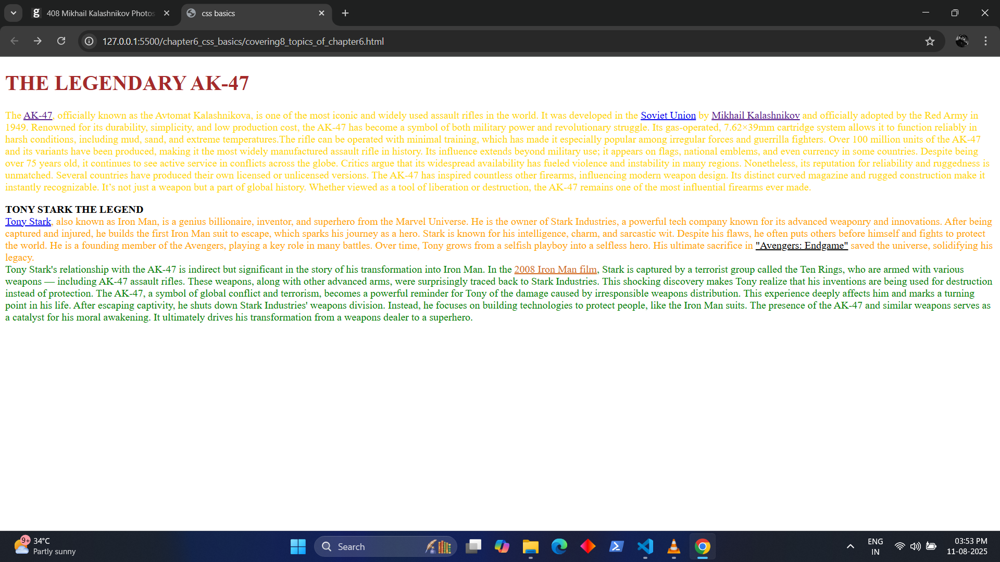
- i put style attribution everywhere in links in paragraphs and in main in div in footler we can put it in everywhere (style attribute) how to put it put style like a attribute and in two commas write what u want border, width, font, color, eg. we put color her i show u how to put color with colon and then ehat type of colour u want put that in semicolon  (color:gree;)  style="color:"

- and what we do if we have a 100's of paragraphs,divs,mains,etc etc and want all style at once for that we use
```<style>
p{color:red;}     (in place of p we can write anything like div, main,h1, h2, heading,footler etc etc) like i write in code down below  (div) 
</style>
```
- that means in style tag we use "p" means paragraph that tells browser style all paragraphs. 
```
<h1 style="color: brown;">THE LEGENDARY AK-47</h1>
    <style>
        div{
            color: rosybrown;
        }
    </style>
    <div>
        The <a href="https://www.istockphoto.com/photos/ak-47">AK-47</a>, officially known as the Avtomat Kalashnikova, is one of the most iconic and widely used assault rifles in the world. It was developed in the <a href="https://en.wikipedia.org/wiki/Soviet_Union">Soviet Union</a> by  <a href="https://www.gettyimages.in/photos/mikhail-kalashnikov">Mikhail Kalashnikov</a> and officially adopted by the Red Army in 1949. Renowned for its durability, simplicity, and low production cost, the AK-47 has become a symbol of both military power and revolutionary struggle. Its gas-operated, 7.62×39mm cartridge system allows it to function reliably in harsh conditions, including mud, sand, and extreme temperatures.The rifle can be operated with minimal training, which has made it especially popular among irregular forces and guerrilla fighters. Over 100 million units of the AK-47 and its variants have been produced, making it the most widely manufactured assault rifle in history. Its influence extends beyond military use; it appears on flags, national emblems, and even currency in some countries. Despite being over 75 years old, it continues to see active service in conflicts across the globe. Critics argue that its widespread availability has fueled violence and instability in many regions. Nonetheless, its reputation for reliability and ruggedness is unmatched. Several countries have produced their own licensed or unlicensed versions. The AK-47 has inspired countless other firearms, influencing modern weapon design. Its distinct curved magazine and rugged construction make it instantly recognizable. It’s not just a weapon but a part of global history. Whether viewed as a tool of liberation or destruction, the AK-47 remains one of the most influential firearms ever made.
        </div>
    </p>
      <b> TONY STARK THE LEGEND</b>
    <div>
        <a href="https://en.wikipedia.org/wiki/Tony_Stark_(Marvel_Cinematic_Universe)">Tony Stark</a>, also known as Iron Man, is a genius billionaire, inventor, and superhero from the Marvel Universe. He is the owner of Stark Industries, a powerful tech company known for its advanced weaponry and innovations. After being captured and injured, he builds the first Iron Man suit to escape, which sparks his journey as a hero. Stark is known for his intelligence, charm, and sarcastic wit. Despite his flaws, he often puts others before himself and fights to protect the world. He is a founding member of the Avengers, playing a key role in many battles. Over time, Tony grows from a selfish playboy into a selfless hero. His ultimate sacrifice in  <a style="color: black;" href="https://en.wikipedia.org/wiki/Avengers:_Endgame">"Avengers: Endgame"</a> saved the universe, solidifying his legacy.
    </div>
    <main style="color: green;">
        Tony Stark's relationship with the AK-47 is indirect but significant in the story of his transformation into Iron Man. In the <a style="color: chocolate;" href="https://en.wikipedia.org/wiki/Iron_Man_(2008_film)">2008 Iron Man film</a>, Stark is captured by a terrorist group called the Ten Rings, who are armed with various weapons — including AK-47 assault rifles. These weapons, along with other advanced arms, were surprisingly traced back to Stark Industries. This shocking discovery makes Tony realize that his inventions are being used for destruction instead of protection. The AK-47, a symbol of global conflict and terrorism, becomes a powerful reminder for Tony of the damage caused by irresponsible weapons distribution. This experience deeply affects him and marks a turning point in his life. After escaping captivity, he shuts down Stark Industries' weapons division. Instead, he focuses on building technologies to protect people, like the Iron Man suits. The presence of the AK-47 and similar weapons serves as a catalyst for his moral awakening. It ultimately drives his transformation from a weapons dealer to a superhero.
    </main>
    <footer style="color: darkolivegreen;">so that was the story of relation of ak 47 with tony Stark</footer>
    <div>
        Wanda Maximoff, also known as Scarlet Witch, is a powerful member of the Avengers.
She possesses extraordinary abilities, including telekinesis, telepathy, and reality manipulation.
Originally introduced as a reluctant ally, Wanda later became a trusted hero.
Her powers are fueled by strong emotions, making her one of the most formidable Avengers.
She shares a deep bond with Vision, which shapes many of her choices.
Wanda’s journey is filled with loss, sacrifice, and personal growth.
Despite her struggles, she continues to fight for what she believes is right.
    </div>
    <div>
        Captain America, whose real name is Steve Rogers, is one of the most respected Avengers.
Originally a frail young man, he became a super-soldier through the Super Soldier Serum.
He is known for his unshakable sense of justice, courage, and leadership.
Armed with his iconic vibranium shield, he defends the world against evil.
Steve always puts the safety of others before his own life.
His moral compass makes him a symbol of hope and integrity.
Even when times are dark, Captain America inspires people to stand strong.
    </div>
```

# external styles
 - external styles means write css in another file and then link it with html we can link that css with thousand of html files at once through link tag (link is self closing tag ```<link   />```) self closing.
 ```<link />
 eg. we wrote css in chapter6.css file eg.
 ``` div {
    color: green;
    font-size:30px;
 }
 ```
 - then i can link this css file with unlimited html file take here our own file 
 in html file i wrote ```<link href="chapter6.css" rel="stylesheet"/>``` if css file is in another folder then we have to metion that here we make in same folder so only write direct name of css file and to join two file u need to put one more attribution in link tag called (rel) write style sheet with rel ....

## anatomy of css
- ist we select something put curly braces{}
and put property in curly braceswith colon and which property in semicolon eg.
```
p{
    color:black;
    font-size: 30px;
    diaplay:flex;  (etc etc,,,,)
}
```
## css selesctors
- selesctors are what we select to style eg.
```
P{
    color:red;
}
```
here selector is p means paragraph
  # element selector
  ** 
  element selctors are simple selectors in css like their name eg
  p, div, h1,h2,main,footler,body,a,like we litreally have to write their names 
  to select that thing to style 
  **
  *
  those simple selectors where we only have to write their name to select for style are called element selectors eg. below 
  *
  ```
p{
    color: greenyellow;
    font-size:20px;
}
a{
    color:grey;
    font-size:25px;
}
div{
    font-size: x-large;
    color: coral;
}
h1{
    font-size: xx-large;
    color: black;
}
h2{
    font-size: 30px;
    color: aqua;
}

  ```
  ## the world of css

  # the background-color
  - when we have to change the background color of anything like body,h1,h2,p,
  - div,main,a, etc etc... we just write in them eg in div
```
  div{
    background-color: olive;
  }
```
# the rgb colour(225,225,225);
- look thr rgb colour called (red,green & blue)
- which means we can make any colour by putting the value in rgb eg.
``` body{
    background-color:rgb(120,220,150);
}
```
- here we are making body background color black because 0,0,0 level is black
** in rgb we can to from 0 to 255 level **
* and if we make all levels 255,255,255, it is white *
another example
```
p{
    background-color:rgb(0,0,0);
    color:rgb(255,120,225);
}
```
- eg in below picture
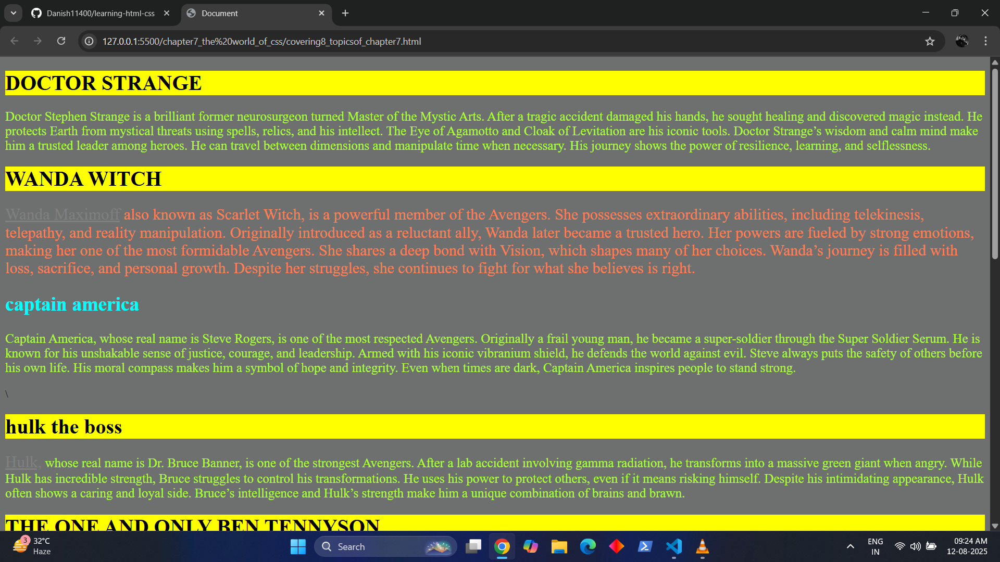
** (in simple we can make different colours by putting value in rgb) **
# hexadecimal colors
* same as rgb just typing value is different i will show u the value in below picture

** its value goes from 0 to 9 an dthen a to f **
* here a represents 10 and f represents 15 *
eg here
```
body{
    background-color:#ffff00;
}
```
# opacity of colors 
- opacity means intensity of colors
- for opacity we generally use (rgba)
eg.
```
main{
font-size:35px;
color:rgba(123,234,0,0.56);
}
```
** opacity value goes from 0 to 1 **
* and another way to do that opacity thing is use directly use opacity title * eg.
** remember opacity title also use values from 0 to 1 **
```
h2{
    font-size: 30px;
    color: aqua;
    opacity:0.72;
}
```
 ** one and only difference between rgba and opacity title is that if we say eg. **
 ```
 main{
font-size:35px;
background-color:rgba(123,234,0,0.56);
}
``` 
** here only background opacity changes not also of text ** but
```
h2{
    font-size: 30px;
    background-color: aqua;
    opacity:0.72;
}
```
** here opacity of background changes but also opacity of text also changes **

# inherit
- look inn css many proprty inherit their parent property eg. color etc etc
- but border did not inherit parent property eg.
```
<p>
    In a world where heroes from different universes unite, Wanda Maximoff, the Scarlet Witch,<span> uses her chaos magic to protect reality itself. Captain America stands as the fearless leader</span>, guiding the team with courage and strategy. Hulk’s unmatched strength smashes through any <em>obstacle in their path</em>. Doctor Strange opens portals and bends time to give them the upper hand in battles. From another dimension, Ben 10 arrives, transforming into powerful aliens to aid the fight. Gwen Tennyson, with her magical abilities and intellect,<strong> works alongside Wanda to weave protective spells</strong>. Kevin Levin uses his absorption powers to enhance his combat strength. Together, they form an unstoppable alliance of magic, might, and technology. Their combined powers make even the greatest villains tremble. Bound by trust and the goal to save worlds, they stand ready for any challenge.
</p>
```
```
p{
    color: greenyellow;
    font-size:20px;
}
```

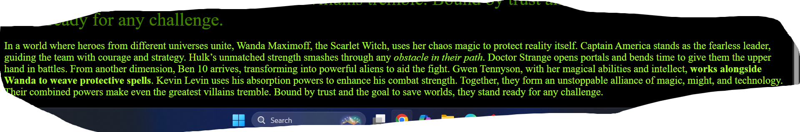
- here i apply color to paragrapgh and when i run code the em,strong,span elements also get colour (inherit from parent(paragraph)) but we can change colour of our elemnts from parent element eg'
strong{
    color:grey;
}
** but (border) is the one that did not inherit from parent eg.
```
p{
    color: greenyellow;
    border:3px solid black;
}
```
**
look here i apply border to my paragraph which only p inherit not the elements in p like span, em , strong, a, etc etc. result in shown in below line

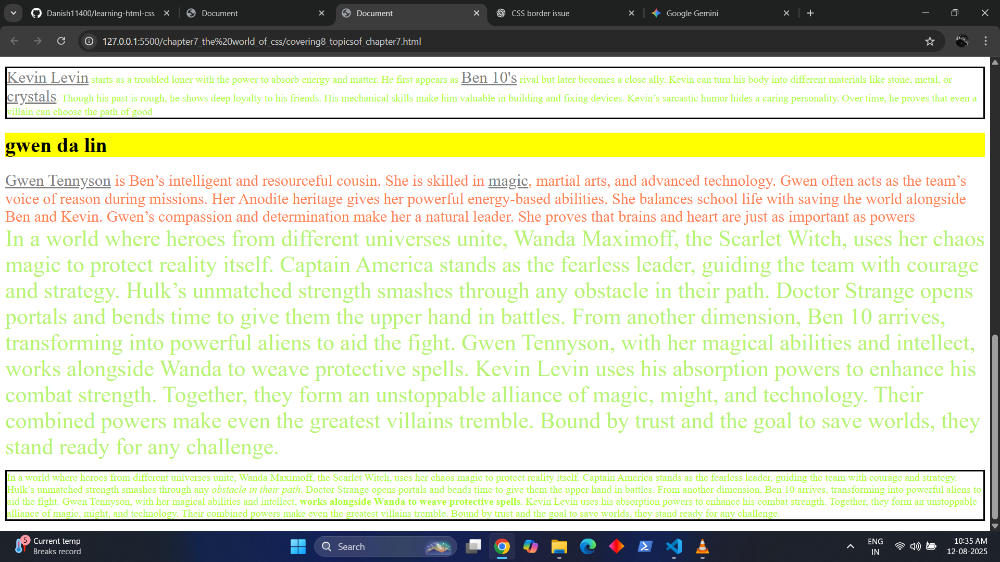


## chapter 8 styling text
# font-family 
- how to apply eg.
```
body{
    font-family: system-ui, -apple-system, BlinkMacSystemFont, 'Segoe UI', Roboto, Oxygen, Ubuntu, Cantarell, 'Open Sans', 'Helvetica Neue', sans-serif;
}
h1{
    font-family: 'Gill Sans', 'Gill Sans MT', Calibri, 'Trebuchet MS', sans-serif;
}
```
- why we use that much font because some are avialable in mac and some are avilable in windows and we vs code give us suggestion of fonts in a line (in aline every font is of only one type but with differnt names due to window and mac) and we apply every one in that line becuse the one is avilable in this according ton our pc is applied.

# font-size
applied same as everything in css eg.
```
h1{
    font-size:30px;
}
```
# font-weight
- font weight means (bold,normal,lighter,bolder we cam also we numeric no in 100's (100 to 900 etc)).
```
body{
    font-weight:bold;
}
```
# font-style
```
body{
    font-style; italic;
}
```
- font-style can be (normal,italic,oblique.)
# text-align
- where u want to put the text eg.(in center,left or end, right or start, justify)
- justify is the option where we can make text justify i mean if user shrinks the screen he can read the text line by line.eg. of justify with code and result pic.
```
body{
    font-weight:bold;
    text-align: justify;
}
```
- justify result is in below video.

[▶️ Watch the video](https://youtu.be/M1RCA05mTlg)
or we can right center
```
h1{
    text-align: center;
}
```
# letter-spacing
space between the letters eg'
```
<h1>hello<h1>
and 
h1{
    letter-spaceing:10px;
}
```
** we got result h  e  l  l  o (means space between the letters) **
 # word-spacing
- put space between the words
 ```
 body{
    font-family: system-ui, -apple-system, BlinkMacSystemFont, 'Segoe UI', Roboto, Oxygen, Ubuntu, Cantarell, 'Open Sans', 'Helvetica Neue', sans-serif;
     word-spacing: 20px;
}
 ```
 # line-height
 - put space between the lines.
 also wrote in px
 # adding custom fonts with google fonts
 - mean swe can add very special fonts from google fonts website it give me href link to link in my html file and then write that font name in css file to apply eg.

look at google fonts i saw a font and copy its html code 
```
<link rel="preconnect" href="https://fonts.googleapis.com">
<link rel="preconnect" href="https://fonts.gstatic.com" crossorigin>
<link href="https://fonts.googleapis.com/css2?family=Akronim&display=swap" rel="stylesheet">
```
then go to css type their
``` 
body{
    font-family:akronim;
}
```
** akronim is the name of the font **
and it applies let me show u by picture
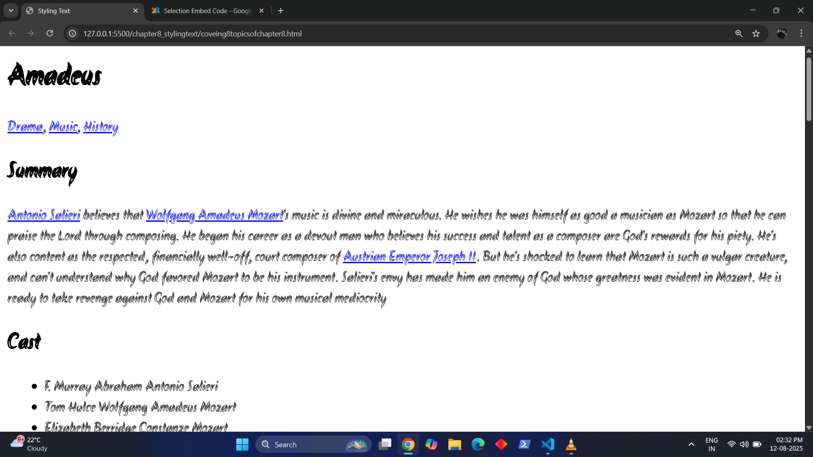

# text-shadow
- put shodow in the text with can add multiple shadows also eg'
```
h1{
    text-shadow: 2px 2px 1px cyan;
}

```
** ist pixel is for x axis shadow **
** 2nd pixel is for y axis shadow **
** 3rd pixel is for bluring shadow **
eg' i will give u pic of result
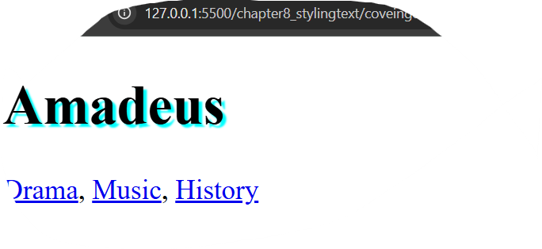
 also we can add multiple shadows in one eg'
 ```
h1{
    text-shadow: 2px 2px 1px cyan, -3px 2px 2px magenta, 2px 1px 3px olive;
}
 ```
 result is in below pic
 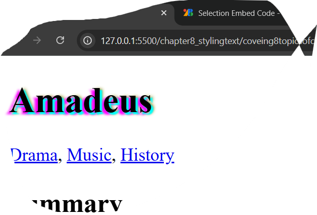
 # width: 55%;
 - we can give the width to the text also for how much percent of page after text go to next line
 ## chapter 9 more text styling
 # text-transform
 - text transform used to change casing of text (capatlize, uppercase,lowercase)
 - in capatlize = text 1st letter of every word changes in capital
 - in upper and lowercase (each letter of text changes into capital & small)which we slect eg'
 ```
  <h1>Lorem ipsum dolor sit amet consectetur adipisicing elit. Autem quae vel esse porro molestiae voluptatibus debitis, et illum facere laudantium possimus at beatae iure aspernatur cum iusto, natus nobis laborum.</h1>
 ```
 ** 
 note when we transform the text the links in that text automatically turns under line
 to change that  we neet to type``` text-decoration;none;```
 on that para or any other thing
 **
 ```
h1{
    text-transform: capitalize;
}
 ```
 # text-decoration
 - hey we decorated text through text decoration (line on the text)
 - we can decorate (text-decoration-line,text-decoration-style,text-decoration-color)
-  we can write them in two ways; eg.
```
- 1st way easy type text decoration and add what type of colour u want in line , what type of line u want, and what effect of line u want and they are without comma
h1{
    text-transform: capitalize;
    text-decoration:cyan line-through dotted 50px;
}
```
- and the second way
```
h1{
    text-transform: capitalize;
    /* text-decoration:cyan line-through wavy ; */
    text-decoration-line:underline ;
    text-decoration-color: olive;
    text-decoration-style: dotted;
    text-decoration-thickness:50px;
}
```
# id-attribute in css
 - look if we have to style any element we select that in css and start styling
 - but what if eg. we have to style a paragrapgh only one paragrapgh and we have a lot paragraph in html then all paragrapghs style at once but we have to style only one or two paragraph so for that we add id attribute at that place eg.
 ```
<div>Lore quisquam asperiores?</div>
    <div id="hello">Lorem ipsum porro sapiente. Cum eveniet Distinctio, soluta?</div>
    <div>Lorem ipsum doloricabo maiores.</div>
```
```
#hello{
    color: cyan;
    font-style:italic;
}
```
- here from 3 divs we style only one of our own choice with the help of id attribution
- and in css we have to use the id name that we put with hash (#)
# class selector
- works same as id selector
-just in place of hash in css in id selector use .(dot) eg.
```
<div>Lore quisquam asperiores?</div>
    <div class="hello">Lorem ipsum porro sapiente. Cum eveniet Distinctio, soluta?</div>
    <div>Lorem ipsum doloricabo maiores.</div>
    <div class="hello">lodhebde hewhwsn cugwsuhs jekiekb dhjjd hjdkiekj hdggduid jidggd jj </div>
```
```
.hello{
    text-decoration-line: line-through;
    text-decoration-color: pink;
    text-shadow:3px,2px,3px, pink;
    font-style: italic;
}
```
# list-style-type
- in this we can style un ordered list by ```list-style-type:----:``` eg,
```
<ul id="listsbro">
        <li>pizza, burger, momo</li>
        <li>chicken, biryani, mutton</li>
        <li>pen, pencil, notebook</li>
        <li>cigg, tobacco, cigar</li>
        <li>japan, russia, saudi</li>
    </ul>
```
```
#listsbro{
    list-style-type: lower-greek;
}
```
# list-style-image
- we can put small images also in unordered list like we ahve to do is 
```
#hello{
    list-style-image:put the link in it
}
```
# styling links
- if we have to style links we can style them different ways eg.
- if we have to style visited links (those links where we tap or we visit)
- we have to type
```
<h1>Lorem ipsum dolor sit <a href="https://www.google.com">google</a> consectetur adipisicing elit. Autem quae vel esse porro molestiae voluptatibus debitis, et illum facere laudantium possimus at beatae iure aspernatur cum <a href="https://www.fb.com">facebook</a>, natus nobis laborum.</h1>
    <p>Lorem ipsum dolor sit, amet consectetur adipisicing elit. Sit alias consequuntur eius obcaecati, eaque hic iste temporibus, numquam quisquam facere  <a href="https://www.codepen.com">codepen</a>fugiat quis nam sapiente molestiae architecto accusantium ex unde velit!</p>
```
```
a:visited{
    color: chocolate;
}
```
# we can also hover links not only links but we can hover anything
** (hover is when we take cursor on the text(we only take cursor their we cant tap) which we hover changes its style style can be anything color , line, font, etc) eg.
```
a:hover{
    color: darkgreen;
}
and if we want to style the link by lines when we hover or just go over the link then ist we have to do text-decoration in "a" none eg.
a{
    text_decoration:none;
}
a:hover{
    text-decoration:underline;
}
or
h1:hover{
    color: darkslategrey;
}
```
we can style cursor also when cursor goes that place which we hover eg .
if we hover links when cursor goves over links cursor shape changes eg.
```
a:hover{
    color: darkgreen;
    cursor: pointer;
}
```
## chapter 10 selector pt. 1

# universal selector(*)
- if we type * it is universal selector eg.[IT SELECTS EVERY THING]
```
*{
    color:red;
}
```
- every thing on the page gets red.
# attribute selector
- but why we should select attributes 
- like give colours or style checkboxes input text boxes etc how to select attributes eg.
```
<input type="text" placeholder="username">
        <input type="number" placeholder="rating">
        <label for="permission">I give you permission to use my rating: </label>
        <input type="checkbox" id="permission">
```
```
input{
    background-color: rgb(225, 255, 0);
}
```
- all input select exept checbox and gets yellow
- i will show u its result also in below pic
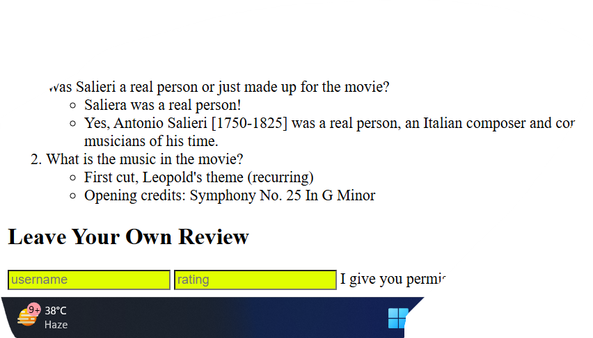
*
 but if we have to select one specific input then we have to write its (type) in square bracket also eg.
 *
```
<input type="text" placeholder="username">
        <input type="number" placeholder="rating">
        <label for="permission">I give you permission to use my rating: </label>
        <input type="checkbox" id="permission">
```
```
input[type="number"]{
    background-color: rgb(225, 255, 0);
}
```
# selecting one type of links
- eg. we have wikipedia links in our page and we have instagram links in our page and we have twitter links in our page and we want to style wikipedia links differnt and instagram links different and twitter links differnet then eg.
```
 <p>
        <a href="https://en.wikipedia.org/wiki/Antonio_Salieri">Antonio Salieri</a>
        believes that
        <a href="https://en.wikipedia.org/wiki/Wolfgang_Amadeus_Mozart">Wolfgang Amadeus Mozart</a>'s music is divine
        and
        miraculous. He wishes he was himself as good a
        musician as Mozart so that he can praise the Lord through composing. He
        began his career as a devout man who believes his success and talent as a
        composer are God's rewards for his piety. He's also content as the
        respected, financially well-off, court composer of
        <a href="https://en.wikipedia.org/wiki/Joseph_II,_Holy_Roman_Emperor">Austrian Emperor Joseph II</a>. But he's
        </p>
```
** 
here we have wikipedia links and we want to style wikipedia links same at once so **
to slect all wikipedia links at once find commom word in wikipedia links eg here we found (wiki) commom word in all 3 links.
** 
```
a[href*="wiki"]{
    color: olive;
    font-weight: bold;
}
```
* its important to put star beacuse it selects all  links with wiki word *

### hey i have some notes of html on my book one of them is 
## if we have to link any thing within the page we put # name in href ist then name but we dont put # in id then eg. 
```
<ul>
        <li><a href="#summary">Summary</a></li>
        <li><a href="#cast">Cast</a></li>
        <li><a href="#reviews">Reviews</a></li>
    </ul>
    <h2 id="summary">Summary</h2>
```
## now come to the point that if we have to select that link which starts with hash(#)
- then we use ```[href^="#"]``` eg.
```
a[href^="#"]{

}
```
## and now if we have to select those links which ends with .org
- then use 
```
a[href$=".org"]{

}
```
## grouping selectors
** if we have to style differnt elements same **
** then how can we do that once ** eg.
if we have to do same style foe h1 h2 h3 p div thyen use comma eg.
```
h1,h2,h3,h4,p,div
{
   color:cyan;
}
2nd example
.tag, .class, featured{
    color:white;
    background-color:black;
}
```
#### only thing to remeber is dont put comma on last one

## descendant element 
* 
it means eg. in my html code i have every spans and i want to style same only those spans that are in <li> then i wrote like this
```
<ul>
        <li>F. Murray Abraham <span>Antonio Salieri</span></li>
        <li>Tom Hulce <span>Wolfgang Amadeus Mozart</span></li>
        <li>Elizabeth Berridge <span>Constanze Mozart</span></li>
        <li>Roy Dotrice <span>Leopold Mozart</span></li>
        <li>Simon Callow <span>Emanuel Schikaneder</span></li>
        <li>Christine Ebersole <span>Katerina Cavalieri</span></li>
        <li>Jeffrey Jones <span>Emperor Joseph II</span></li>
    </ul>
```
```
li span{
    color: blue;
    font-family: serif;
}
```
- that means style those spans only which are nested in li (we just have to put space between those no commas not anything just space)
## but if i have many spans nested in many li at differnet places and in want to style this particular one just put id attribution in its ui and then do eg. here we put id="cast"
```
<ul id="cast">
        <li>F. Murray Abraham <span>Antonio Salieri</span></li>
        <li>Tom Hulce <span>Wolfgang Amadeus Mozart</span></li>
        <li>Elizabeth Berridge <span>Constanze Mozart</span></li>
        <li>Roy Dotrice <span>Leopold Mozart</span></li>
        <li>Simon Callow <span>Emanuel Schikaneder</span></li>
        <li>Christine Ebersole <span>Katerina Cavalieri</span></li>
        <li>Jeffrey Jones <span>Emperor Joseph II</span></li>
    </ul>
```
```
#cast li span{
    color: red;
}
or 
#cast span{
    color:red;
}
```
- here also put space only between them.
## child combinator
eg. in below html code 
```
<ol>
            <li>Was Salieri a real person or just made up for the movie?
                <ul>
                    <li>Saliera was a real person!</li>
                    <li>Yes, Antonio Salieri [1750-1825] was a real person, an Italian composer and conductor. As the
                        Austrian imperial Kapellmeister from 1788 to 1824, he was one of the most important and famous
                        musicians of his time.</li>
                </ul>
            </li>
            <li>What is the music in the movie?
                <ul>
                    <li>First cut, Leopold's theme (recurring)</li>
                    <li>Opening credits: Symphony No. 25 In G Minor </li>
                </ul>
            </li>
        </ol>
```
we have li inside ul and ul inside ol and we want to style only li of ol but if we type

``` li{```
    ```border: 1px solidblue;```
```    }```
but we want to style only lis of ol here every li gets styled then we use 2nd method
```
ol li{
    border: 1px solidblue;
}
```
* but here also the same problem ul lis are also inside ol li's then we do this
```
ol > li {
    border: 1px solidblue;
}
```
**then finally we get only ol li's selected**
### and the reason i use border here is due to border is not inherit while color is so what we type if we type color it can inherit in all li's

## what if i have to style id or class in a specific element
**eg i have to style class which is in h2**
```<h2 class="score">Average Rating: 9.1/10</h2>```
and in my code i have large no. of classes already but i have to style this one only then
```
h2.score{
    color:red;
}
```
### dont put space betwween these if we put space between then then it thinks like emmm the score that are nested in h2 but we dont have nested class is attribute and atributes are not nested


### chapter 11 the box model
## in this chapter we will study about border, padding and margin , i will show u photo of that then we will explane that 


## border
- in this we can make border
- and then we style border like(border-color, border-width, border-style)eg.
```
 <h1>I Am The Leader</h1>
```
```
h1{
    border-width: 2px;
    border-color: green;
    border-style: ridge;
}
```
**but we can style them at once eg.**
```
h1{
    border: 2px cyan dotted;
}
```
__but we can also style every side of border differently eg.__
```
h1{
    border-bottom: 3px darkgreen solid;
    border-top: 5px double magenta;
    border-right: 4px dotted olive;
    border-left: 6px solid red;
}
```
## the border(height, width, and percentage)
- if we make border i can cross through the page we can contol that by these eg.
```
 <h1>I Am The Leader</h1>
 ```
 ```
h1{
    border: 4px green solid;
    width: 300px;
    height: 75px;
}
```
## now what is the use of percentage; eg.
```
<div id="container">
        <div class="box"></div>
    </div>
```
eg. here we have div inside div we can make borders for both eg if we give height and width to ist div and wants to give height and width of second div according to ist box we can control them by percentage eg.
```
#container{
    border: 4px solid magenta;
    width: 400px;
    height: 100px;
}
.box{
    border: 3px solid olive;
    width: 50%;
    height: 40%;
}
```
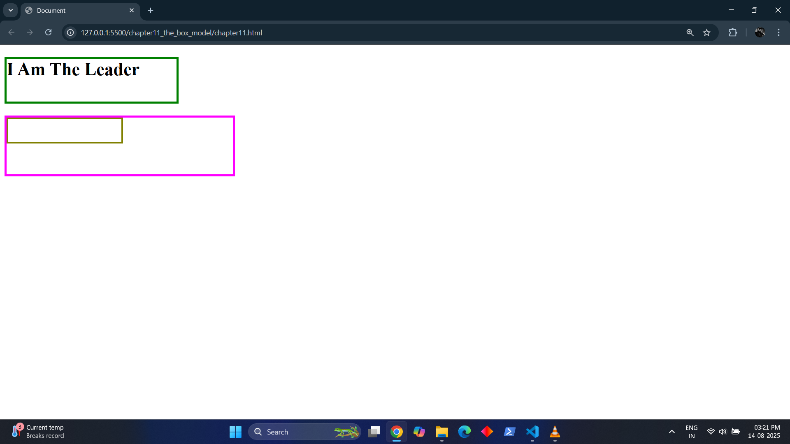
im 2nd div we make its width and height according to ist like we keep its width 50% of ist  and height 40% of ist 
__we can only style with percentage the box which is inside of any other box__
## padding.
- in the box we write the main content but if u see the content we write shows from the right side of box like it remains attached to the box so to make the content in center we use padding eg.
```
<h1>I Am The Leader</h1>
```
```
h1{
    border: 4px green solid;
    width: 300px;
    height: 75px;
    padding: 20px;
}
```
- when we use padding and put single value it applies space from 4 side example in upeer coding or we can use it seperately on different sides eg.
```
h1{
    border: 4px green solid;
    width: 300px;
    height: 75px;
    padding-left: 20px;
    padding-bottom: 30px;
    padding-top: 30px;
    padding-right: 30px;
}
```
or we can use differnt value for differnt sides in one eg.
```
h1{
    border: 4px green solid;
    width: 300px;
    height: 75px;
   padding: 20px 30px   40px    50px;
            TOP  RIGHT  BOTTOM  LEFT (this is the order)
}
```
## as u see we made 2 boxes but still inside box is connected to the upper box so to put space between them we use margin eg.
```
<div id="container">
        <div class="box">hi</div>
    </div>
```
```
.box{
    border: 3px solid olive;
    width: 50%;
    height: 40%;
    margin: 8px;
}
```
and the result is
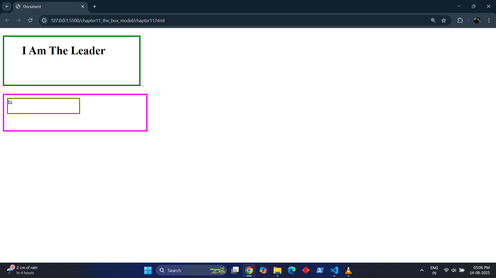
**we can put space(margin) in outer boxes also not only with inside and outside boxes eg.**
```
<h1>hello brother</h1>
    <h2>what brother</h2>
```
```
h1{
    border: 4px green solid;
    width: 300px;
    height: 75px;
   padding: 20px 30px 40px 50px;
   margin: 5px;
}
h2{
    border: 6px solid black;
    margin: 4px;
}
```
also we can use margin seperately for different sides like
```
 margin-top: 2px;
    margin-bottom: 3px;
    margin-right: 3px;
    margin-left: 2px;
```
also use margin at one like padding eg.
```
h2{
    margin: 2px 4px    5px      6px;
            TOP RIGHT  BOTTOM   LEFT
}
```
# box-sizing:border-box
 - look if we type
 ```
 .box{
    width:100px;
    height:200px;
    border: 5px solid green;
    padding:20px;
 }
 ```
 - we get a content (that we wrote) of same px we put but the box is of more eg in height the box is 250px like 200+20+20+    5+5=250 same with width eg.
                           padding   border
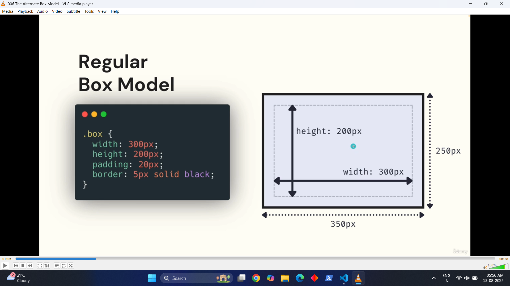
 so to contol that we use 
  ```
 .box{
    width:300px;
    height:200px;
    border: 5px solid green;
    padding:20px;
    box-sizing: border-box;
 }
 ```
 now the result is
 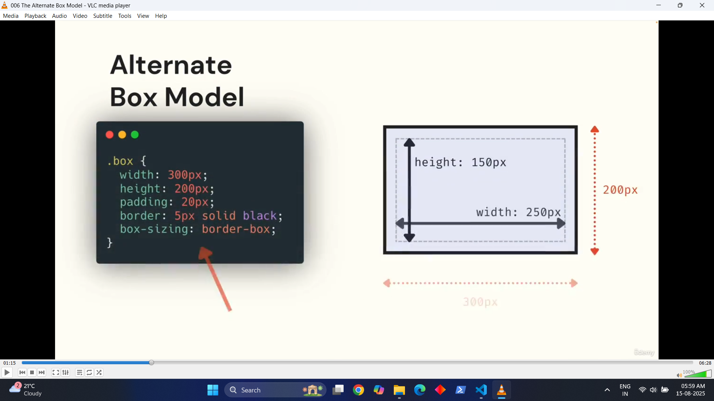
 ## display property
 - i will tell u by example
 ```
 <h1>hello commander</h1>
   <p>Lorem ipsum dolor sit amet consectetur adipisicing elit. Saepe recusandae minima cum temporibus amet at magnam <span class="brick">voluptatibus</span> quo, nostrum ullam cupiditate ut pariatur sint iure reiciendis atque quos id quis! Lorem ipsum, dolor sit amet consectetur adipisicing elit. Animi iure autem distinctio impedit ipsum aspernatur ullam similique nisi debitis nemo velit officiis nesciunt ipsa, earum temporibus maxime iste blanditiis placeat! Lorem ipsum dolor sit, amet consectetur adipisicing elit. Ratione mollitia deleniti velit, suscipit laudantium iure natus, perspiciatis praesentium id doloremque itaque nam quisquam ea ullam atque eligendi voluptates possimus consequuntur.</p>
 ```
 ```
h1{
    border: 5px solid olive;
    width: 200px;
    height: 100px;
    padding: 20px;
    margin: 3px;
    box-sizing: border-box;
}
h1{
     border: 5px solid green;
    width: 200px;
    height: 100px;
    padding: 20px;
    margin: 3px;
}
 ```
 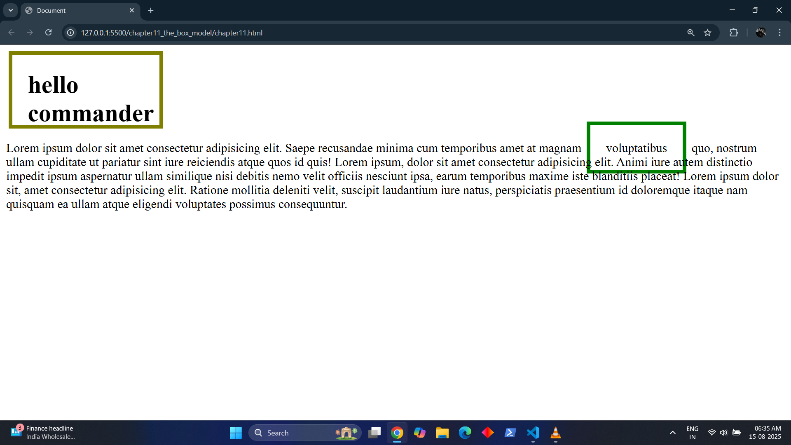
  - you can see in this picture after adding padding and margin to both h1 and span 
  (span are making space only from left and right correctly and combine with other lines from top and bottom while h1 make space from four sides this is due to span is an inline element so to control this display of the differnt elements we use [display]) eg.
```
display:block;
or 
dispaly:inline;
or 
display:inline-block;
```
  we will difine this in below pictures
  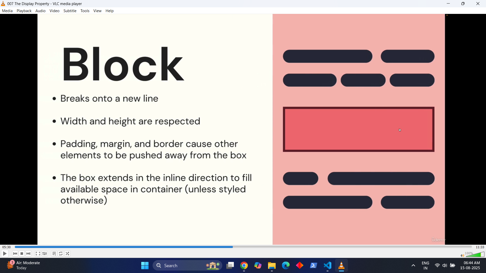
  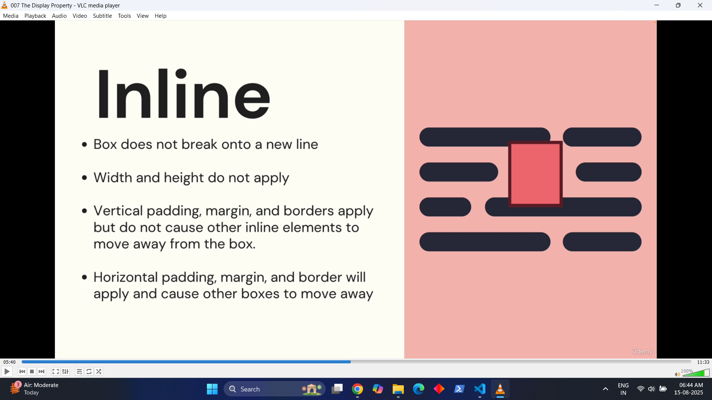
  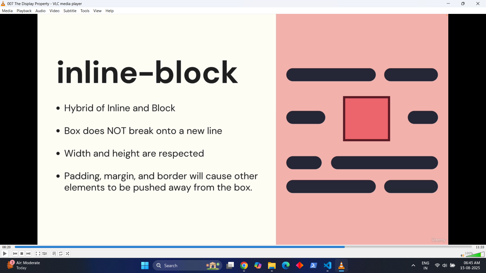
  - and w ecan display=none to hide things but the thing is their eg.
  ```
   <h1>hello but why?</h1>
  ```
```
  h1{
    border: 5px solid olive;
    width: 200px;
    height: 100px;
    padding: 20px;
    margin: 3px;
    box-sizing: border-box;
    display: none;
}
```
  - the h1 hides from the page but it still there it uses in website page's later we use that
  ## negative and center margin
  - hey as we know if we write something browser gives margin to that automatically and if we think that margin given by browser is very large we can decrease by giving margin negative value eg.
```
<h1>hello but why?</h1>
   <h2>hello chewengam sir</h2>
```
- here browser gives margin this automatically but if we think that is very big so we can decrease it by typing.
```
h1{
    border: 5px solid olive;
    width: 200px;
    height: 100px;
    padding: 20px;
    margin: 3px;
    box-sizing: border-box;
    margin: -20px;
}
```
# margin auto eg.
- if we make box and inside box we put heading in the center of left and right we can do that by typing margins 50% from left and right and 0 from top and bottom but in simply we write 
```
margin: 0                   auto;
        top and bootom      left and right (put it in center)
```
## min and max width
eg. we make abox in body then user shrinks or expand that box that much width we keep at remains same how much u shrinks or expands but at some point it becomes ugly so to control that we use.
```
.box{
    min-width:60%;(it means how much u shrink the box increases from bottom but when we shrink more than 60% of width the box stops incresing because it becomes ugly )
    max-width:60%;(it means how much u expand the box increases from left and right but when u expands the page more than 60% of width it stops incresing)
    width:400px;
    height:300px;
background-color:blue;
}
```
## border-radius
- it helps to change box style eg if we make box it can be sqaure or rectangle but we can control its edges by boder-radius eg.
```
 <div id="box">
   </div>
```
```
#box{
background-color: magenta;
width: 400px;
height: 400px;
border-radius: 50%;(it applies for all top radius right bottom left or we can use it seperately for each side eg.)
}
```
- the corners of the box is the 50% of width and height eg in below pic
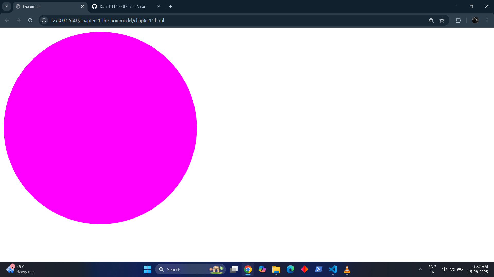
```
border-radius: 10px 30px  40px   26px;
               TOP  RIGHT BOTTOM LEFT
```       
or 
```
border-top-right-radius: 30px;
border-top-left-radius: 40px;
border-bottom-right-radius: 30px;
border-bottom-left-radius: 30px;
```
## box-shadow 
- we can make shadow for box by 
```
#box{
background-color: magenta;
width: 400px;
height: 400px;
border-radius: 50%;(it applies for all top radius right bottom left or we can use it seperately for each side eg.)
box-shadow: 2px       2px        3px     cyan;
            x axis    y axis     blur    color
}
```or if we have to go opposite side we can go by typing negative values 
eg.```
#box{
background-color: magenta;
width: 400px;
height: 400px;
border-radius: 50%;(it applies for all top radius right bottom left or we can use it seperately for each side eg.)
box-shadow: -2px       -2px        3px     cyan;
            -x axis    -y axis     blur    color
}
```
## overflow
- some times our text is very bigh and cant fit in our box so we use overflow eg.
```
overflow: scroll;(it allows us to scroll the content in the box)
        : hideen;(it allows us to hide the content which is over flow from the box)
        : visible;(it allows us show overflow)
```
or we can control overflow in axises eg.
```
overflow-x: hidden;
overflow-y: scroll;
```
**note padding applied inside and margin applied outside of border**

### chapter 13
## adjacent selector eg.
```
<h1>hello brother</h1>
    <p> Lorem ipsum dolor sit amet consectetur, adipisicing elit. Placeat voluptatibus nesciunt asperiores magni soluta esse quas fuga earum voluptates illo temporibus quaerat, nostrum porro, dolore optio eligendi voluptatem ipsam nemo.</p>
    <p>Lorem ipsum, dolor sit amet consectetur adipisicing elit. Exercitationem provident voluptatibus totam dignissimos iste, eveniet eligendi ratione, nam error expedita accusantium impedit sit sint consectetur quo voluptate quod tempore qui?</p>
```
```
h1 + p {
    font-style: italic;
    font-family: 'Lucida Sans', 'Lucida Sans Regular', 'Lucida Grande', 'Lucida Sans Unicode', Geneva, Verdana, sans-serif;
    color: green;
}
```
- here we type h1 + p ( means style only that one p which is after h1)
## sibling combinators
eg .
```
 <h1>hello brother</h1>
    <p> Lorem ipsum dolor sit amet consectetur, adipisicing elit. Placeat voluptatibus nesciunt asperiores magni soluta esse quas fuga earum voluptates illo temporibus quaerat, nostrum porro, dolore optio eligendi voluptatem ipsam nemo.</p>
    <p>Lorem ipsum, dolor sit amet consectetur adipisicing elit. Exercitationem provident voluptatibus totam dignissimos iste, eveniet eligendi ratione, nam error expedita accusantium impedit sit sint consectetur quo voluptate quod tempore qui?</p>
    <p>Lorem ipsum dolor sit amet consectetur, adipisicing elit. Atque accusantium voluptate tempora illo, deserunt quis ut repellendus, quibusdam odio deleniti sequi adipisci asperiores consectetur sed eveniet totam expedita tempore velit.</p>
```
```
h1 ~ p {
    font-style: italic;
    font-family: 'Lucida Sans', 'Lucida Sans Regular', 'Lucida Grande', 'Lucida Sans Unicode', Geneva, Verdana, sans-serif;
    color: green;
}
```
- here we type h1 ~ p that means (all the paragraphs that came after h1)
## hover we can style anthing while hover
eg
```
h1:hove{

}
div:hover{

}
- i mean anything
```
and 
```
input:placeholder-shown{
    color:red;
}
```
## first-of-type
eg.
```
li:first-of-type{
    color:olive;
}
```
means where ever li are present in that page style every 1st li from every li's
same with last-of-type
```
li:last-of-type{
    color:olive;
}
```
means style every last li in the li's
## nth-of-type
eg.
```
li:nth-of-type(2){
    color:magenta;
}
```
- it style every 2nd li from each li's
**NOTE WE HERE USING LI BUT IT CAN BE USED ON ANY OTHER ELEMENT ALSO LIKE A HOVER**
or 
## nth-of-type(2n)
```
li:nth-of-type(2n){
    color:blue;
}
```
- means in eacg li's select every 2nd then 4th then 6th like that and go on...
(like even no.'s)
or 
```
li:nth-of-type(3n){
    color:blue;
}
```
- here it selects every 3rd then 6th then 9th then go on...
## active
- (means at the time we use they style eg in button at the time we use they gets style) eg.
```
button:active{
    color:cyan;
}
```
at the moment we press the button button gets active or in use form then it gets styles little bit same as hover
## focus eg.
```
input:focus{
    colour:choclate;
}
```
means when we tap on any thing means we start focus on that thing so it gets styled thats it.
## not eg.
```
body:not(h1,h2,h3,h4,p){
    border: 1px solid green;
}
```
means everything in the page except those that i select in bracket style 
## first-line eg.
```
p::first-line{
    color:blue;
}
```
means ist line of every paragraph or
```
h1::first-letter{
    colour:red;
}
```
we can also write by mixing eg.
```
p:first-of-type::first-letter{
    color:blue;
}
```
that mean select ehere ever paragraphs in that page select ist paragraph and from that paragraph select ist letter
## to select placeholder text we use
```
input::placeholder{
    color:magenta;
}
```
## selection
```
p::selection{
    color:indigo;
}
```
- means when user selects any text from page from paragarph it style eg. we select a text from paragraph to copy it styles not only paragrah it can be anything that we use 
## checked eg.
```
input[type="radio"]:checked{
    box-shadow:0px 2px 3px cyan;
}
```
means that radio button box we checked or selected turns into style when we check it  
## specificity
eg.
```
<h1 class="hello">hello</h1>
```
```
h1{
    color:blue;
}
```
```
.hello{
    color:magenta;
}
```
--- which one wins here what colour the text get its called specifity which is more specific wins class is more specific than elemnet i will give u table of that in below pic
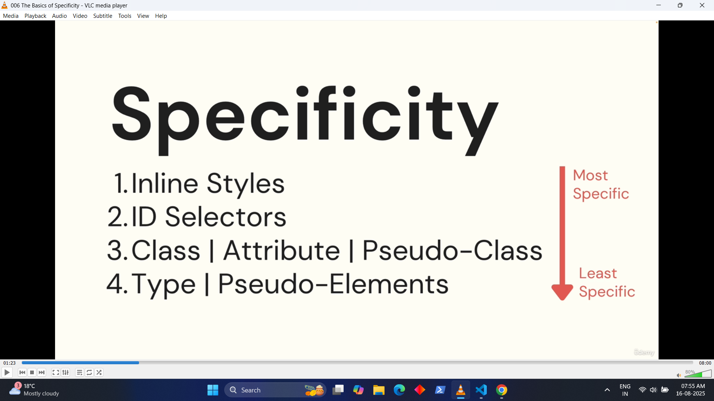 
- now we know if we have elemnt selector and class selector we know class wins but what happen if we have like h1,h2, h3,div etc etc so to under stand that i will give u example from pic

in this pic lets assume both select the same thing but which one wins browser starts seeing froom left side then big number came ist wins.
__after applying specificity what wins after specifity i will give u the table of that below in a pic and thats called cascade 
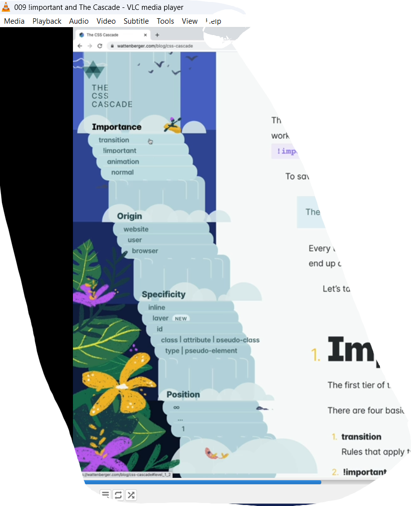  
## cascade 
# !important eg.
```
<h1 class="brick"> hello world <h1>
```
```
#brick{
    colour:blue;
}
```
```
h1{
    color:magenta;
}
```
- here we know id wins but if we add this 
```
#brick{
    colour:blue;
}
```
```
h1{
    color:magenta !important;( then h1 wins as u see in above pic important is more big than specificity)
}
```
### chapter 14 css units
- i just have to know that we use measurement in css is not actual world measurements like 1cm in css is not 1cm in real world same with all like px ,mm ,etc etc i will provide u the pics of units in css below
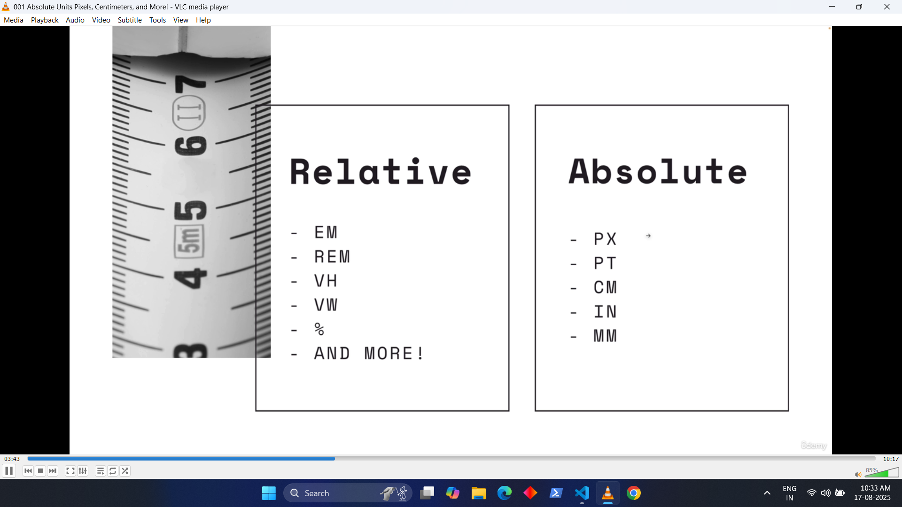
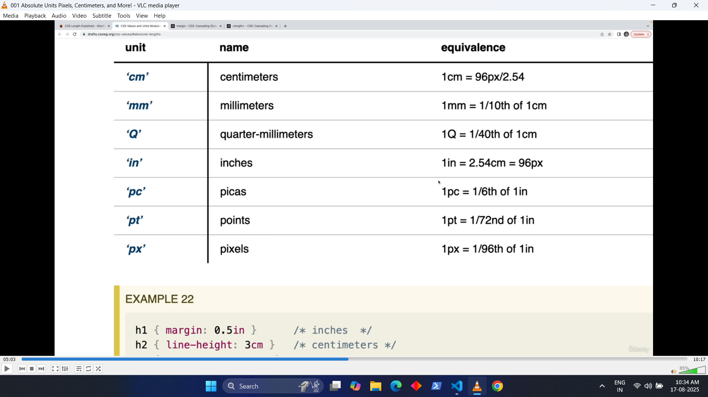
## percentages
- in most of the cases if we type percentage is 50% means 50 % of parent element
- but in (line-height) it means 50% font-size of elements itself same as we write in "em"

## rem
- rem is used for font-size look in our browsers we have been given automatic font-size
from the browsers[called root-font-size] which (in medium is 16px)
- so if we apply font-size is 2 rem that means twice of root font size which is 2*16=32px
-if we type 1rem that is 1*root font size
-3rem that means 3*root font size ( 3 * 16=48px)
we can also change root font size from our browser go to browser then tap on setting then font size we can also change it but 16px is best
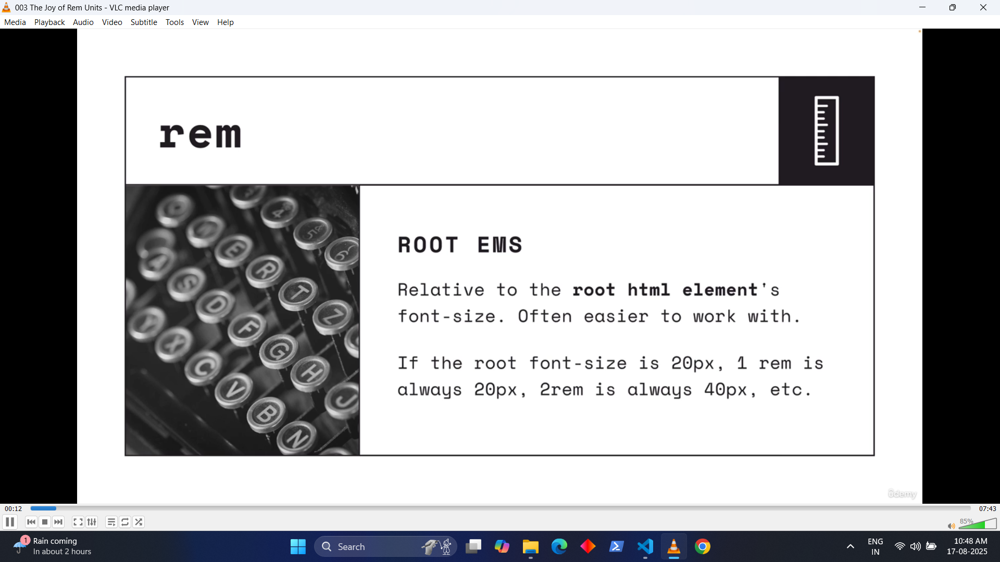
## em
- its basically related to font-size of parent element eg. if we type 1em that means 1*parent font size
if we type 3em that means 3*parent font size 
**"em" is same as "rem" but related to (parent element) not (root element)**
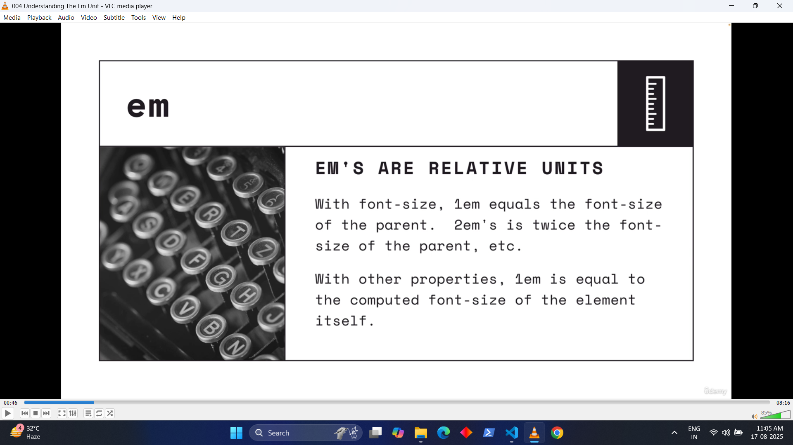
- except font-size (like rem) 2em is equal to the twice of element itself eg.
```
<div class="tap">
       <div id="fix">Lorem ipsum dolor sit, amet consectetur adipisicing elit. Fugit enim vitae reprehenderit voluptatibus porro inventore quidem explicabo, nihil officiis nesciunt fugiat provident voluptates ab quas voluptatem at accusamus corrupti. Doloribus.</div>

    </div>
```
```
.tap{
    font-size: 30px;
}
#fix{
    font-size: 2em;
    margin-left: 4em;
}
```
- here i fit parent font-size 30px
- then i make child font-size 2em(that means 2 * parent font size(30px) = 60px)
- then in child i make margin 4em that means (4 * size of element itself which is 60px = 240px of margin from left)
- beacuse we know other than font-size in em size is taken from element itself
## vw and vh
- vw is the viewport width 
- vh is viewport height
- viewport means (the one screen we view )
if we write width:100vw
           height:100vh
- means 100% of screen we view at a time
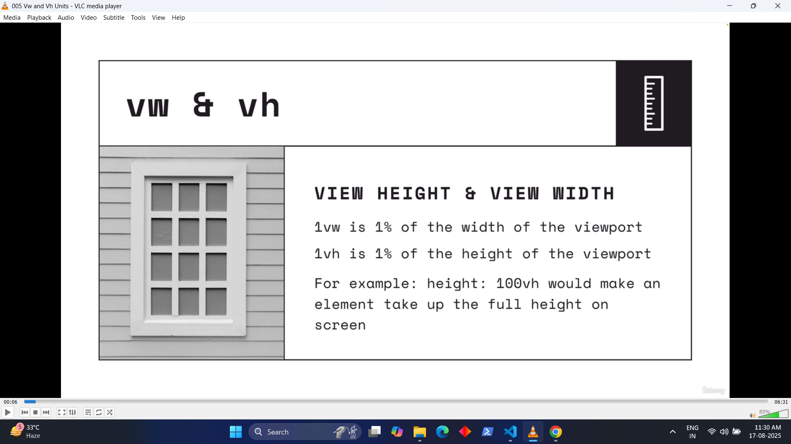
## float
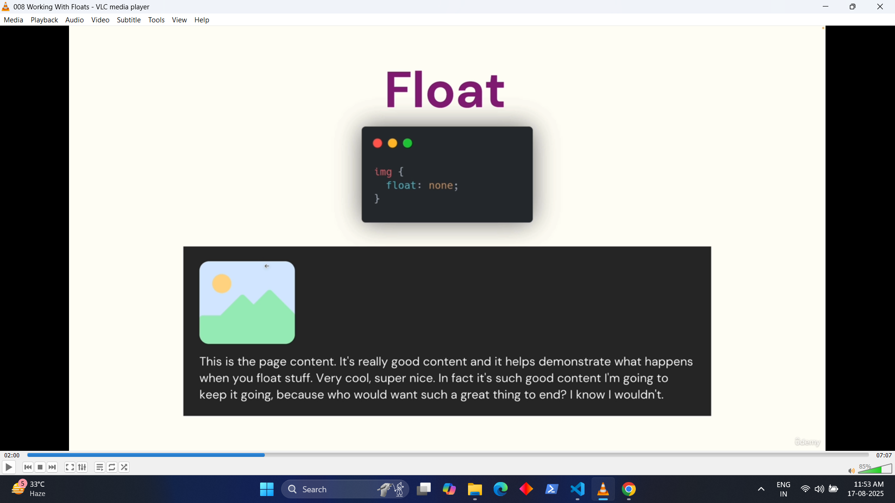
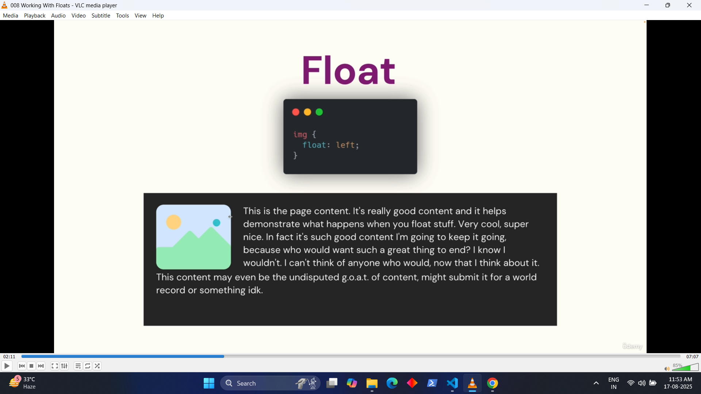
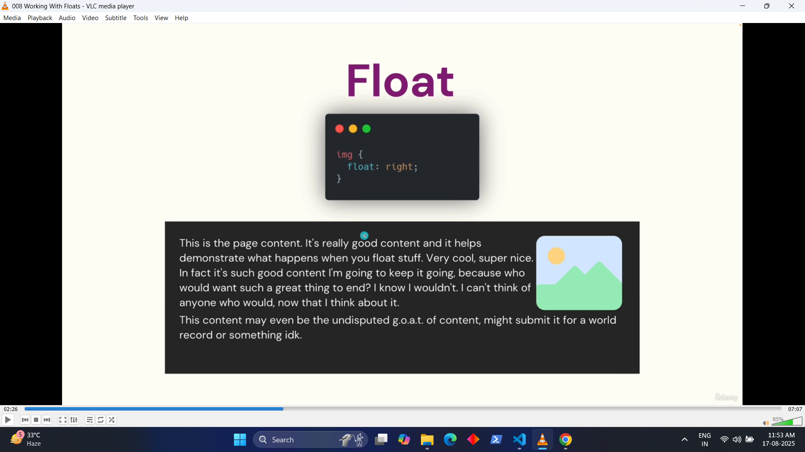
### chapter 15
## background-images
- we can add images in the background eg.
```
<main>
        <div class="tap">Lorem ipsum, dolor sit amet consectetur adipisicing elit. Quis deleniti praesentium alias, porro dolorum quaerat, voluptatum magni repellat nulla iure odio commodi, voluptatem optio explicabo temporibus illo aut asperiores mollitia!</div>
    </main>
```
```
div{
    border: 1px solid red;
    width: 300px;
    height: 300px;
    background-image: url("../images/peacock.png");
}
```
- we can also add more images at the same time with comma and we can add images from browser
## background-repeat
- as we seen in upper side image is very short than the width & height we give the element so image repeats himself to fill the container to control that we can use
```
div{
    border: 1px solid red;
    width: 300px;
    height: 300px;
    background-image: url("../images/peacock.png");
     background-repeat: no-repeat;
                      : repeat-x;(for repeat in a axis)
                      : repeat-y;(for repeat in y axis)
}

```
## background-size
- we can control image size eg
```
div{
    border: 1px solid red;
    width: 300px;
    height: 300px;
    background-image: url("../images/people.jpg");
    /* background-repeat: repeat-y; */
background-size: contain;(here it makes actual image size without shrinking or expanding it and if the container is too big then it starts repeating the image then if we put repeat is no-repeat then in the container have some space where it repeates)
}
```
```
background-size: cover;( in this it didnt shrink and expand also but it wants to cover all the container by the image and if container is not fit for image some  part of image deletes and it didnt repeat the image )
we can also use percentages to image also
background-size: 100%
```
## background-position
if we cover the image and it didnt fit in the container and it cuts our part of image that part was the main part and unman part is shown then we can position it eg .
```
background-position: top; ( that means our top part should be seen and bottom should cut)
we also have bottom,right,left,center
```
or 
```
background-size: cover;
background-position: top right;(means top and right should be seen and left and bottom should be cutted)
background-position: top left;
background-position: bottom left;
background-position: bottom right;
```
## background-clip
- if we have big border sometimes then images some part goes inside it at ends
and we dont want that we just want that images dididnt go inside border we want omly that image go till padding after padding border starts and image should stop their so we use
```
div{
    background-clip: padding-box;(till padding)
    background-clip:content-box;(border didnot go to padding nor border because it stop at content box)
    background-clip: border-box;(in this images stops at border means image goes inside border box)
}
```
## linear-gradient
```
div{
    border: 3px solid black;
    width: 400px;
    height: 400px;
   background-image: linear-gradient(cyan, magenta,olive);
}

```
result 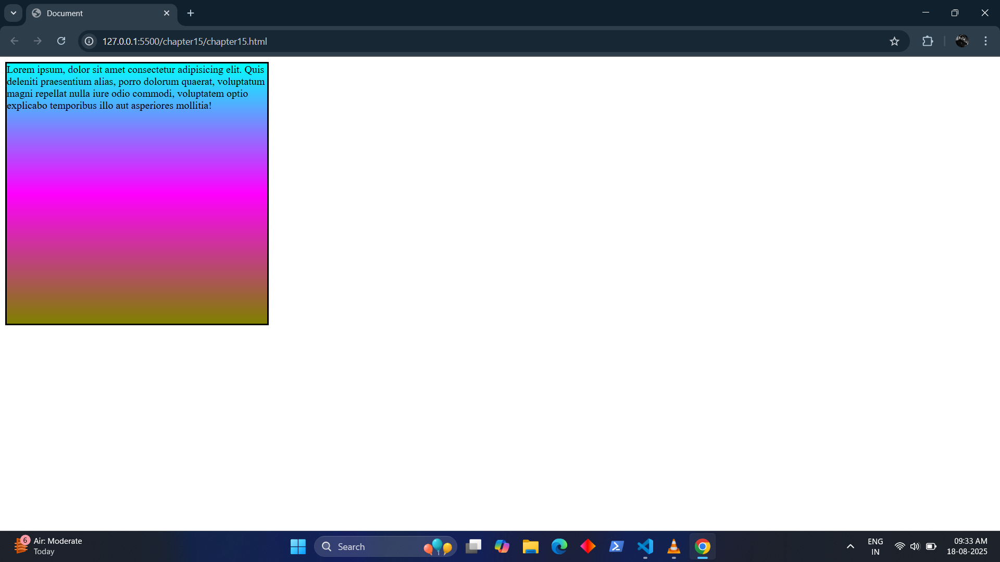
we can also make changes like
```
div{
    border: 3px solid black;
    width: 400px;
    height: 400px;
   background-image: linear-gradient( 45deg,cyan, magenta,olive);
}                                       
                                        ( here 45deg means start from 45degree from the horizontal or any angle we can use )

```
or we can also use direct cmnds like
```
background-image: linear-gradient(to bottom right, cyan, magenta,olive);
                                     (means starts from top left and ends to bottom right other comands are also same )
```
we can also control width of colors like
```
 background-image: linear-gradient(to bottom right, cyan 20%, magenta 10%,olive 70%);
 here i am not saying that cyan is 20% i am saying that cyan starts at 20% magenta starts at 10% and after 70% olive starts (percentage here is at what percentage of the container that color starts or begin)
```
## radio-gradient
in this we can make gradient from center to outward eg
```
background-image: radial-gradient(cyan, green);
```
and we can control this with cmnds
```
background-image: radial-gradient(circle, cyan, green);
background-image: radial-gradient(ellipse, cyan, green);
background-image: radial-gradient( circle at bottom, cyan, green); same as many cmnds
```
## conic-gradient
```
background-image: conic-gradient( cyan , blue)
```
##### also if we need any gradient go any webpage or mdn the gradient u think is best copy the code no need to master this

## repeating-linear-gradient
```
 background-image: repeating-linear-gradient(to bottom right, cyan , magenta ,olive 10%);
   it repeates the gradient again then and the 10% here means it repeates 10times
```
## filter
- it didnt only applies to background image sit also apply images which is not backgroung eg.
```
div{
    color: white;
    border: 3px solid black;
    width: 600px;
    height: 100vh;
   background-image:url(../images/woman.jpg);
   background-size: cover;
   filter: blur(5px);
}
```
and the result is 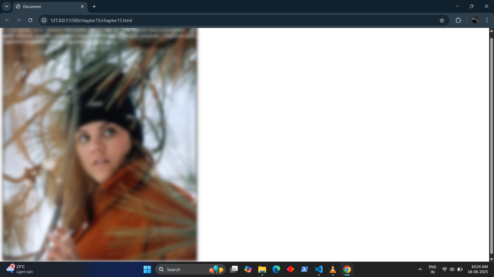
and more the px in blur more the blur also their are some more properties in filter like
```
div{
    color: white;
    border: 3px solid black;
    width: 600px;
    height: 100vh;
   background-image:url(../images/woman.jpg);
   background-size: cover;
   filter: grayscale(100%);(it makes image grey)
}
```
```
div{
    color: white;
    border: 3px solid black;
    width: 600px;
    height: 100vh;
   background-image:url(../images/woman.jpg);
   background-size: cover;
   filter:contrast(150%);[makes image contrast]
}
```
### note 100% is normal means if greyscaleis 100% means normal grey and 100% contrast means above than 100% is we increase and less than 100% is we decreasing 

## heu-rotate
```
   filter:hue-rotate(180deg);[ means it converts the image in negative more degree till 180 degree it increses towards normal to negative and then after increasing after 180 degree it means it going from negative to normal like 180 is full negative and 0 and 360 is normal]
```
we also have saturation,brightness,opacity  and many more which vs code give us options etc etc.


### chapter 16 positioning
the values of position 
```
position:static;
position:relative;
position:absolute;
position:fixed;
position:sticky;
```
## static
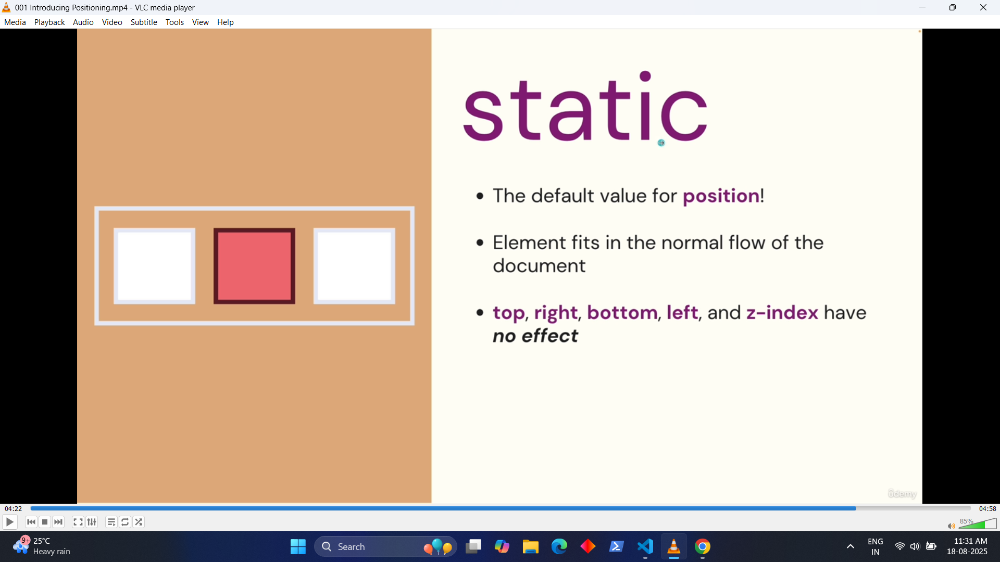

## relative
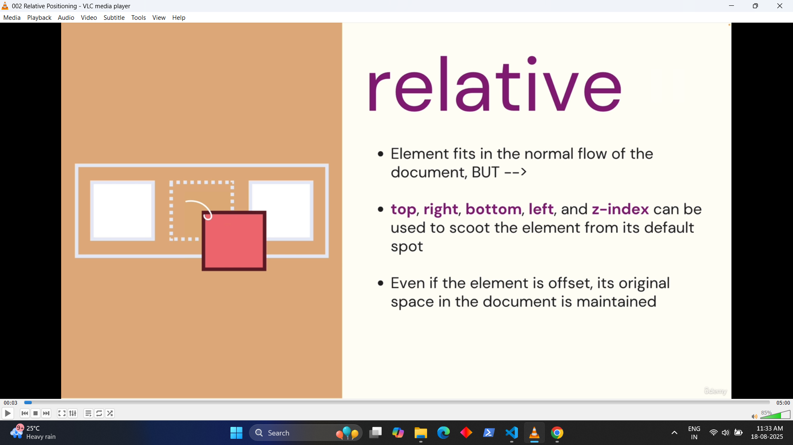
eg.
```
<body>
    <p>Lorem ipsum dolor, sit amet consectetur adipisicing elit. Qui aspernatur ex enim? Inventore quaerat incidunt sed minus. Doloribus molestiae totam quo ut quia nesciunt dicta fugiat omnis, natus nisi aspernatur!</p>
    <p class="bro">Lorem ipsum dolor sit amet, consectetur adipisicing elit. Reiciendis quod animi maiores praesentium inventore sint nam pariatur earum tempora sunt voluptas distinctio unde hic voluptates perspiciatis corrupti, accusantium odio reprehenderit.</p>
    <p>Lorem ipsum, dolor sit amet consectetur adipisicing elit. Quibusdam repudiandae fugit omnis qui placeat minus quam a error facere dignissimos! Dicta quod eveniet sunt id architecto culpa alias modi non!</p>
</body>
```
```
p{
    border: 1px solid black;
    background-image: linear-gradient(cyan, yellow, magenta);
    width: 300px;
    height: 200px;
}
.bro{
    background-image: linear-gradient(olive, grey, purple, green);
    position: relative;
    top: 40px;
    left: 50px;
}
```
the result 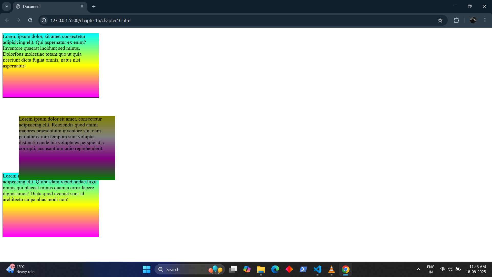
- but remember it also takes its place that it is ist in relative as i defined it in relative pic
## z-index
- z-index applies on that element that is been positioning anything except "static"
z- index is a number that tells which thing comes over on what thing
- i mean the element have more z-inde comes over the element have less z-index eg.
```
p{
    border: 1px solid black;
    background-image: linear-gradient(cyan, yellow, magenta);
    width: 300px;
    height: 200px;
    position: relative;
    z-index: 2;
}
.bro{
    background-image: linear-gradient(olive, grey, purple, green);
    position: relative;
    top: 40px;
    left: 50px;
    z-index: 1;
}
```
look here 2nd paragraph have less z index than other 2 so it the 3rd paragraph came over 2nd [ist also can came over but here it is awayfrom 2nd] and look here we use position relative in both not static if we have used static z-index didnt work then.
result 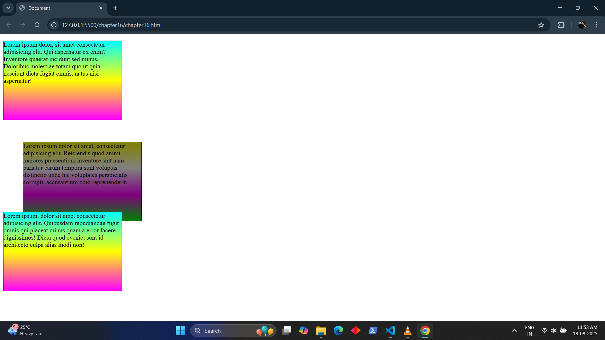
## absolute
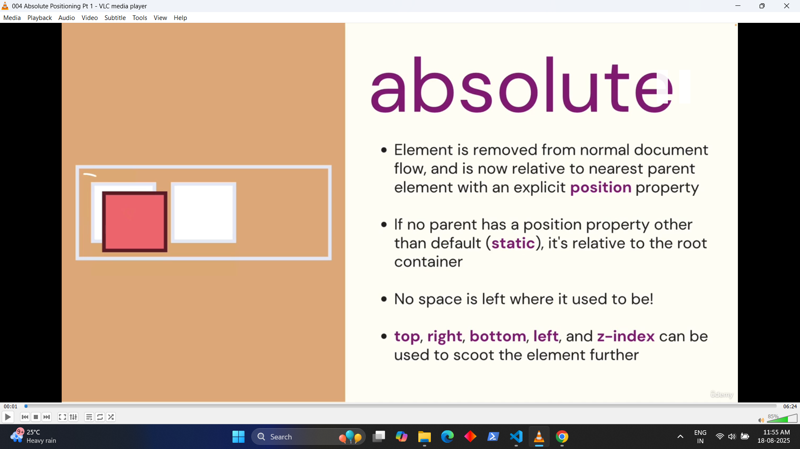
- in this case if we apply absolute the space didint preserve this time it is taken by another element and it starts from the start means from the root html document the webpage eg.
```
p{
    border: 1px solid black;
    background-image: linear-gradient(cyan, yellow, magenta);
    width: 300px;
    height: 200px;
   display: inline-block;
}
.bro{
    background-image: linear-gradient(olive, grey, purple, green);
    position: absolute;
    top: 40px;
    left: 50px;

}
```
result 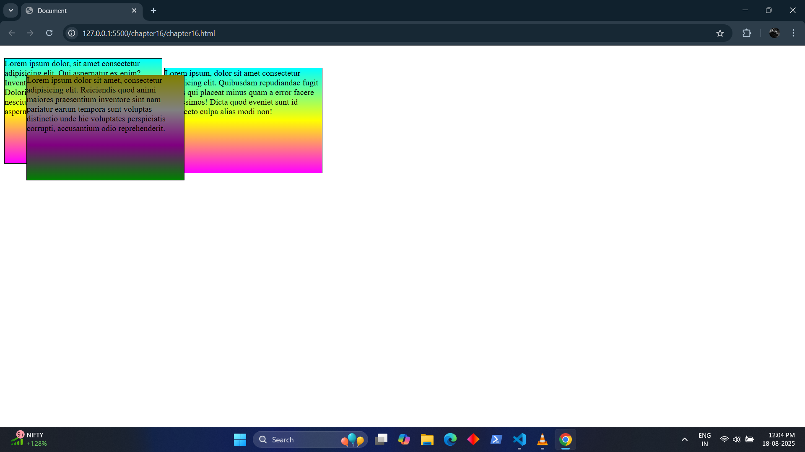
- here what happen is the space preserved in relative is unpreserved in absolute
so we apply absolute here means there is no space provided for the element in ehich we apply and then we start applying top,left,bottom,right [these are applying from the begining of webpage or root html document]
# and if the parent of something is positioning other than static and then the child is positioning absolute then we apply top bottom left right the chils starts from the begining of its parent not from root html document or the start of webpage from the begining of its parent and can only move into the parent area eg.
```
<main>
    <p></p>
    <p class="bro"> hello buddy!<p>
    <p></p>
    </main>
```
```
main{
    border: 1px solid black;
    background-image: linear-gradient(cyan, yellow, magenta);
    width: 300px;
    height: 200px;
   display: inline-block;
   position: relative;
}
.bro{
    background-color: black;
    color: aliceblue;
    position: absolute;
    top: 40px;
    left: 50px;
}
```
- here parent is main and we apply other position except static we apply relative on parent then on .bro is child we apply absolute now see in result pic it starts from its parent begining and can only moves in his parent are only eg. if we apply right = 0 then it goes on the right side of parent area not the root html document.(because he is bind to parent child relation ship)
and except parent child if we apply right =0 it goes to right side of webpage because then he is open he cant bound in parent child relationship
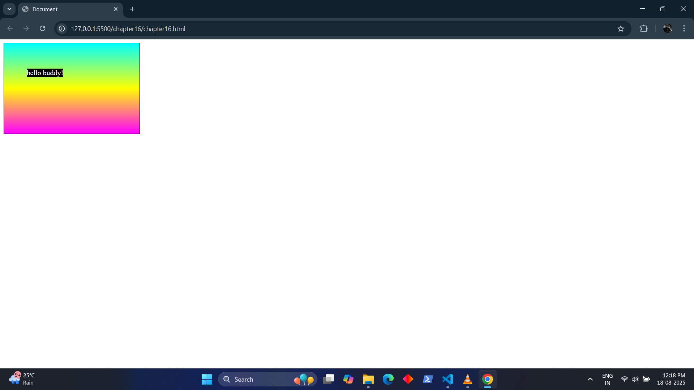
## fixed
- in this the element positio we make fixed remains at their place even we scrol up but it remains that place where we applied it 
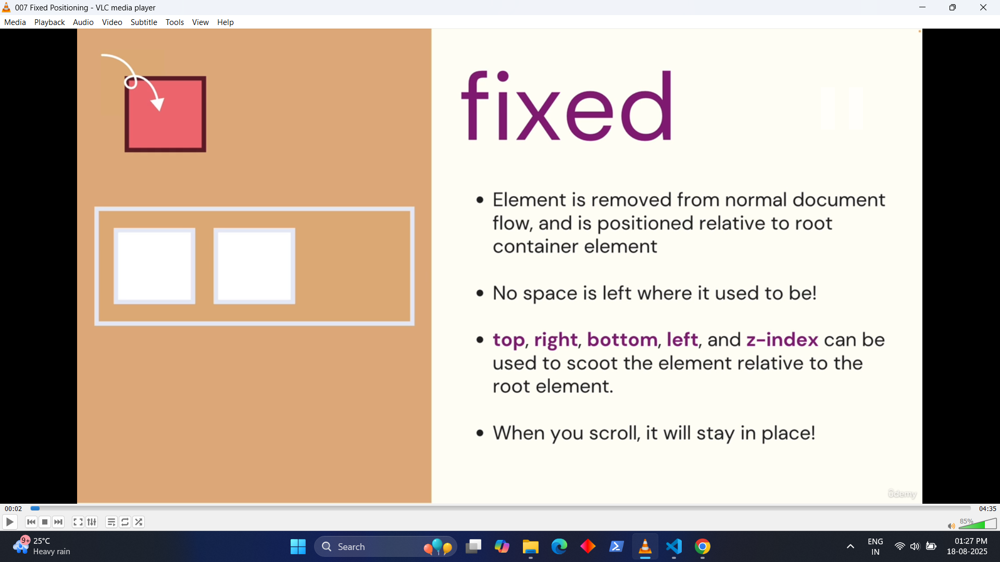

### chapter17 transation and transforms
## the transation syntax
- transition syntax image 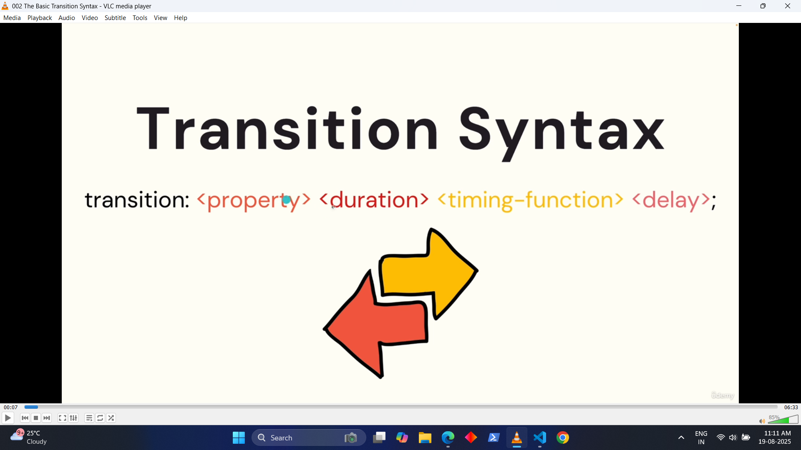
transitinon: <property> <duration> <timing-funcation> <duration>
eg.
```
<body>
    <a href="">hover me!</a>
</body>
```
```
a{
    padding: 10px 20px;
    display: inline-block;
    margin-top: 30px;
    margin-left: 50px;
}
a:hover{
    background-color: orchid;
}
```
- now when we hover it imediately changes color and when we not hover it also sudenly gets normal color but if we add transation
```
a{
    padding: 10px 20px;
    display: inline-block;
    margin-top: 30px;
    margin-left: 50px;
    transition: background-color 3s;
}
a:hover{
    background-color: orchid;
}
```
- look this time i add tranation in direct link not in hover it means it tells browser that whenever background colou changes it should take 3 sec i mean ( when we hover it takes 3 sec and when we remove cusor means[dehover] it takes 3 sec but what if we add transition in hover look )
```
a{
    padding: 10px 20px;
    display: inline-block;
    margin-top: 30px;
    margin-left: 50px;
    
}
a:hover{
    background-color: orchid;
    transition: background-color 3s;
}
```
- here we add transition in hover means when background color changes in hover it takes 3 sec but when we dehover it suddenly goes normal becoz we add transition only in hover broo..[and this isint good thing broo becoz user needs smooth interface]
## multiple transition properties
```
a{
    padding: 10px 20px;
    display: inline-block;
    margin-top: 30px;
    margin-left: 50px;
    color: black;
    text-decoration: none;
    font-size: 30px;
     transition: background-color 3s, color 2s, text-decoration 3.5s, font-family 3s;
}
a:hover{
    background-color: orchid;
    color:white;
    text-decoration: overline red;
    font-family: cursive;
}
```
- look here how many transations i add in this ..
## timing-function
- in this we canm add speed eg.
if we type```ease-out``` it starts quickly and slows down
if we type ```ease-in```it starts slowlu and speeds up
if we type ```linear```it moves in constant speed eg.
```
a{
    padding: 10px 20px;
    display: inline-block;
    margin-top: 30px;
    margin-left: 50px;
    color: black;
    text-decoration: none;
    font-size: 30px;
     transition: transform 10s ease-out;
}
a:hover{
    background-color: orchid;
    color:white;
    text-decoration: overline red;
    font-family: cursive;
    transform: translateX(100px);
}
```
dont worry about transforms here we read it in next lectures 
## transition delay
```
a{
    padding: 10px 20px;
    display: inline-block;
    margin-top: 30px;
    margin-left: 50px;
    color: black;
    text-decoration: none;
    font-size: 30px;
     transition: background-color 3s ease-in 5s;
}
a:hover{
    background-color: orchid;
    color:white;
    text-decoration: overline red;
    font-family: cursive;
    
}
```
- here look i put delay 5 sec that means when i hover ist it takes to 5 sec of delay  then starts changing style that we put and then when we dishover it takes 5 sec of delay then starts changing style that we put..
## transforms
## translate
- used to move things away without using margin eg.
```
 <div id="box"></div>
```
```
 #box{
    width: 100px;
    height: 100px;
    background-color: orchid;
    transform: translateX(500px);
    transform: translateY(50%)  [means 50percentent of width we can use px % and negative values also]
 }
```
translate in x means go away in x direction by 500px
## rotate 
- we can make things rotate eg.
```
 #box{
    width: 100px;
    height: 100px;
    background-color: orchid;
    transform: translateX(500px);
    transform: rotate(45deg);
 }
```
we can conteol it seperately eg.
```
 #box{
    width: 100px;
    height: 100px;
    background-color: orchid;
    transform: translateX(500px);
    transform: rotateX(45deg);
 }
```
- here we rotate it in x axis like a **horizontal cylinder** rotates
```
 #box{
    width: 100px;
    height: 100px;
    background-color: orchid;
    transform: translateX(500px);
    transform: rotateY(45deg);
 }
```
- here it rotates in y direction like a **vertical cylinder** rotates
```
 #box{
    width: 100px;
    height: 100px;
    background-color: orchid;
    transform: translateX(500px);
    transform: rotateZ(45deg);
 }
```
- here it rotates in z direction 
## scale 
- in simple use to make thing strech and expand and value=1 is normal eg.
```
 #box{
    width: 100px;
    height: 100px;
    background-color: orchid;
    transform: translateX(500px);
    transform: scale(0.2);
 }
```
- here i put scale is 0.2 so its gonna strech
- we can use it seperately also eg.
```
 #box{
    width: 100px;
    height: 100px;
    background-color: orchid;
    transform: translateX(500px);
    transform: scaleX(0.2);
 }
```
- straches and expands in x axis only
```
 #box{
    width: 100px;
    height: 100px;
    background-color: orchid;
    transform: translateX(500px);
    transform: scaleY(0.2);
 }
```
- streches and expands in y axis only
```
 #box{
    width: 100px;
    height: 100px;
    background-color: orchid;
    transform: translateX(500px);
    transform: scaleZ(0.2);
 }
```
streches or expands in z axis only
### transform-origin
- used to tell us from what point transform applies eg we we rotate any element but at what point it gonna rotate we select that with origin eg.

```
 #box{
    width: 100px;
    height: 100px;
    background-color: orchid;
    transform-origin: top left;
    transform: translate(100px);
     transform: rotate(45deg);
 }
```
here it starts transform(rotate,translate) from top point towards left side.
### chapter 18 flexbox part1
- just to use place space and put thing away like we do it with margins and float now flex box made us that easier and **personally i am so excited for to use this**
## introduction to flexbox
to use flexbox properties on any element we have to put display:flex; ist then we can use
## flex-direction
- use to give our elements a direction eg.
```
.container{
    border: 2px solid black;
    width: 1200px;
    margin: 40px auto;
    display: flex;
    flex-direction: row;
}
.box{
    width: 150px;
    height: 150px;
    font-size: 4rem;
    text-align: center;
}
```
or we can reverse that by 
```
.container{
    border: 2px solid black;
    width: 1200px;
    margin: 40px auto;
    display: flex;
     flex-direction: row-reverse;
}
.box{
    width: 150px;
    height: 150px;
    font-size: 4rem;
    text-align: center;
}
```
*in column direction*
```
.container{
    border: 2px solid black;
    width: 1200px;
    margin: 40px auto;
    display: flex;
    flex-direction: column;
}
.box{
    width: 150px;
    height: 150px;
    font-size: 4rem;
    text-align: center;
}
```
*reverse column*
```
.container{
    border: 2px solid black;
    width: 1200px;
    margin: 40px auto;
    display: flex;
    flex-direction: column-reverse;
}
.box{
    width: 150px;
    height: 150px;
    font-size: 4rem;
    text-align: center;
}
```


