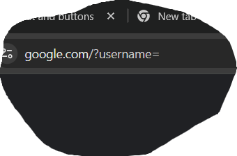
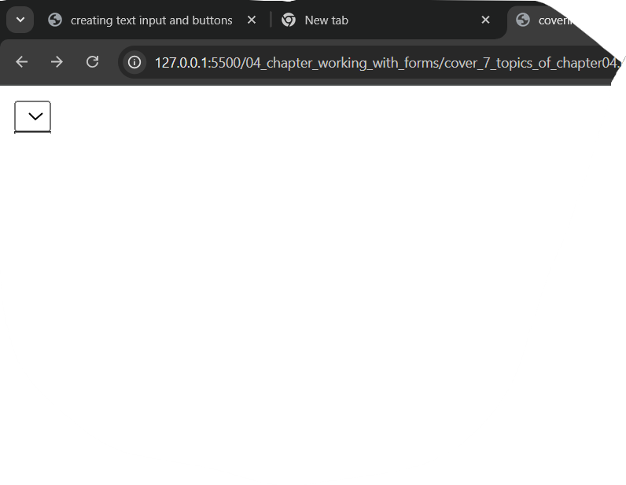
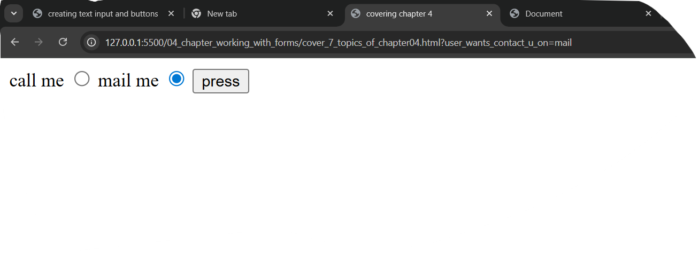
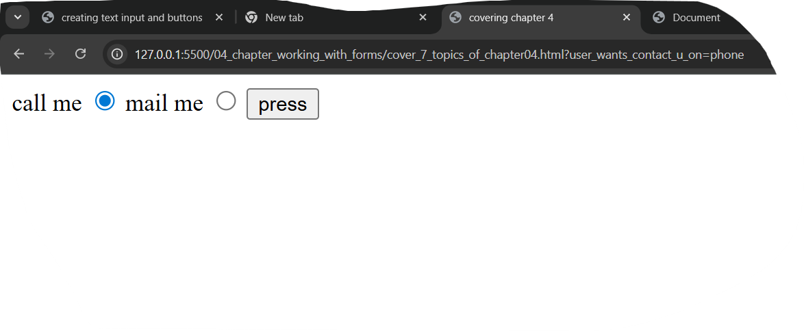

# Fresh Pasta Exercise

This is a simple HTML project that demonstrates a recipe page for making fresh pasta.  
It is created as part of a beginner HTML learning exercise, with no CSS styling applied.

## Project Structure

- **index.html** – The main HTML page containing the recipe content.
- **images/** – Folder containing images used in the recipe.

## Features

- Basic HTML tags (headings, paragraphs, lists, images).
- Recipe instructions for making fresh pasta.
- Semantic HTML structure for better readability.

## How to Open

1. Download the project files.
2. Open `index.html` in any web browser.

## Purpose

This project is made for learning HTML only — **no CSS** is used so that the focus remains on HTML elements and structure.


# chapter 4 WORKING WITH FORMS

This chapter have 7 topics and 1 exercise..


## Topic1 creating text input & buttons

1. This is simple using html tags like if i have to create
text input..

```<input type="text">```

 **REMEMBER INPUT TAG DONT HAVE CLOSING TAG**

- The code make me a simple rectangle where we put text


2. And then i learn making buttons using button tag


```<button>press me<button>```

- and it make the button named press me


 *AND SIR GIVE US THIS TAG FOR BUTTONS* 

```<buttons type="press me">press<buttons>```
- bit lastly told we dont need to write (type) attribute in
buttons tag its not important.


## TOPIC2 the form element

- we learn about form element form element send our data to somewhere
- eg.
```<form>```
```<button>press me</button>```
 ```<input type="text">```

```<form>```


- here it make input text and button in form element
means when we press the button the form element sends our data which we put in 
input text.

- BUT WHERE IT SEND OUR DATA?

- we read one attribute with form element called (method) eg. 

```<form action="login">```
```<button>press me</button>```
 ```<input type="text">```

```<form>```
- here what we did we put action attribute in form element on pressing button form trys
to send our data of input text to some where and action attribute told form element
where to send data eg. here we put login eg. we created a login page in backend then type here login method attribute told form send data to login page

- we can put anything in action attribute eg.

```<form action="https://google.com">```
```<button>press me</button> ```
 ```<input type="text">```
```<form>```
  - here action told form element send data to google.com.

  - and sir tell us about method="get" attribute that tells form element how to send data 
  but sir told we learn it later

 ## TOPIC3 name and place holder attribute

 1. in input tag put name attribute it gives name to url that u put eg.

 ```<form method="https://google.com">```
```<button>press me</button>```
```<input type="text" name="username">```

```<form>```


 - when user put data in text input and press button user go through goodle and then got a name of user name like shown in below picture. the result i got when i search it




 - i can tell u also by typing like it shows result in the line of search bar in web browser like google.com/?username=(what u put in txt input box)


 - like make name of ur search bar of what u search


 2. placeholder attribute 

 - its like a visual representation what u put in is seen on input txt bar
 and when u start tying in text bar it gets dissappear


  ```<form method="https://google.com">```
```<button>press me</button>```
```<input type="text" name="username" placeholder="firstname">```

```<form>```

- then we got a result in text input firstname written in their
and when we press any key it gets disspear


**attributes like (type) (name) (placeholder)**
**should be written in input element**

__hey if i make all sepertely type name and placeholder i got__
    __3 txt bars due to 3 input elements and placeholder works normally but___       __name didint work at all because in url bar it shows kinderjoy but didnt shows__
    __that i type in txt bar__


## Topic4 label

- hey in label tag i study giving label to txt input bar
```<input type="text" name="username">```
     ```<label>type name</label>```

     - it shows me result a txt input box and type name with it but when u tap on type name
     - nothing happen for that 
     - for attribute in label tag 

     ```<form action="https://google.com">```
   ```<input type="text" name="username" placeholder="firstname" id="roti">```
   ```<label for="roti">type name</label>```
    ```<button>press me</button>```

    - we put here for attribute in label and then id at which text input box will it open 
    - eg. when u press type name now cursoe automatically goes to the txt box where u 
    - put the id 

    ## Topic5 different type of inputs

    - like in 
    ```<input type="text">```
    - it gives me txt box where i put any txt but
    - there are many types of input boxes like number (where u can only type no.'s)
    - and (passwors wher u type anything it gets hide )
  - (colour where u can add coloue) (date where u add date)
- important one (required in which input u put required it has to be filled otherwise ub can go nxt box in required you dont have to put required in type="" just put it in <input>)
-and (email where can cant go with writting ....@something)

**except required every input box needs (attribute type="")

## Topic6 checkbox text areas and range inputs

1. checkboxes are the area where u put a box on the page 
- in rows amd colums
``` <form action="">```
        ```<textarea rows="10" cols="10"></textarea>```
     ```</form>```
    - rows and cols are attributes
    you get the result like in below mentioned image

[images/textareabox.png]: images/textareabox.png
- we can wrote this differently without form like
```<textarea rows="2" cols="2"></textarea>```

2. range 
 - when we put range inside attribute the input tag a line appers on webpage which can be controlled by attributes of min and max like how much range it should be have eg.

   ```<form action="google.com">```
      ``` <input type="range" min="0" max="18" step="3" name="habibi">```
       ```<button>press</button>```
       ```</form>```

       - also steps can be added steps another attribute which can control like on one tap how many steps the line took steps the line which makes from range attribute 

      - and if we add name attributre also that input tag we see at whatvrange we are when we search the page on url bar

      3. checkbox
      check bo is another input attribute
      ``` <input type="checkbox">```
      - a box appears which checks tick

      ```<label for="tapmad">mark the box</label>```
       ```<input type="checkbox" id="tapmad">```
       ```<button>tapu</button>```
       - here what we do is 
       - there was simple box first without anythin written we 
       - made a label and then make id which attached bto checkbox
       - so when we tap on mark the box the checkbox marked automatically

       ## Topic7 select and radio button

       1. select is a tag like form or ul or ol
       - in select we can get a select box 
       like if we type 
       ```<select></select>```
       - we get a select button i will put that in below image 
       

-  now in the icon we made should have options in it so we use options tag 
- and value attribution
- eg
``` <form>```
      ``` <label for="pant size">select ur pant size</label>```
    ``` <select name="pant and west size" id="pant size">```
   ``` <option value="size 22 to 28">small</option>```
    ```<option value="size 28 to 36">medium</option>```
    ```<option value="size 36 to 42">large</option>```
     ```</select>```
     ```<button>submit</button>```
     ```</form>```
     - istly when user touches select the pant sixe the box got selected 
     - due to for and id attribution
- here we write select tag after that put options in that with option tag 
- then in option tag we put value attribution value attribution is for owner of website
- and name for options also we put label for the box 
- and for attribution to connect it to icon by id attribution
- in select tag we put options only and website owner data
- label and button is put on form tag
- in select tag we also put name attribution
-  when user selects any option from small medium and large he then presses submit button
- due to from tag it wanna send data but the data we put in value with small due to name  - attribution like we can also see it in the url bar
- i will put some images of the result code down below
[select&option_button_result1](images/select&option_button_result1.png)
[select&option_button_result1](images/select&option_button_result2.png)
[select&option_button_result1](images/select&option_button_result3.png)

2. radio button
- in input tag if we put radio in place of text we got a selecting button 
 ```<input type="radio">```
  - but if we make a full code for it
  ```<form>```
     ```<label for="phone">call me</label>```
     ```<input type="radio" name="user_wants_contact_u_on" id="phone" value="phone">```
     ```<label for="email">mail me</label>```
     ```<input type="radio" name="user_wants_contact_u_on" id="mail" value="mail">```
     ```<button>press</button>```

    ```</form>```

    - here we add label with radio and text of call me id for and id = phone 
    - then we keep those in form to send the data but we keep value phone and email
    - then form send us value with name which we wrote in name attribute
    - i will attach some result pics below

    
     

    