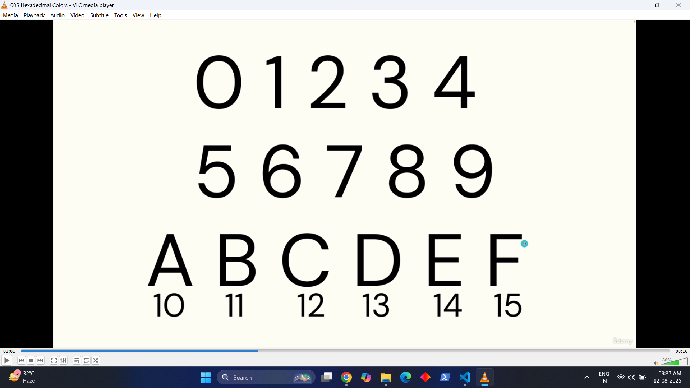

# Fresh Pasta Exercise

This is a simple HTML project that demonstrates a recipe page for making fresh pasta.  
It is created as part of a beginner HTML learning exercise, with no CSS styling applied.

## Project Structure

- **index.html** – The main HTML page containing the recipe content.
- **images/** – Folder containing images used in the recipe.

## Features

- Basic HTML tags (headings, paragraphs, lists, images).
- Recipe instructions for making fresh pasta.
- Semantic HTML structure for better readability.

## How to Open

1. Download the project files.
2. Open `index.html` in any web browser.

## Purpose

This project is made for learning HTML only — **no CSS** is used so that the focus remains on HTML elements and structure.

# Chapter 4 – Working With Forms

This chapter has 7 topics and 1 exercise.

## Topic 1 – Creating Text Input & Buttons

1. This is simple using HTML tags. For example, if I have to create a text input:

```<input type="text"> ```
REMEMBER: The input tag does not have a closing tag.

This code makes a simple rectangle where we can put text.

And then I learned about making buttons using the <button> tag:

text
```<button>Press Me</button>```
This makes a button named Press Me.

AND SIR GAVE US THIS TAG FOR BUTTONS:

text
```<button type="button">Press Me</button>```
But lastly, he told us we don’t need to write the (type) attribute in the button tag — it’s not important.

Topic 2 – The Form Element
We learned about the form element. The form element sends our data somewhere.
Example:

text
```<form>```
   ```<input type="text">```
   ```<button>Send</button>```
```</form>```
Here, it makes an input text box and a button inside the form element, meaning when we press the button, the form element sends our data (which we put in the input text box).

BUT WHERE DOES IT SEND OUR DATA?

We read about one attribute of the form element called (action):

text
```<form action="login">```
   ```<input type="text">```
   ```<button>Send</button>```
```</form>```
Here, the action attribute in the form element tells the form where to send data. For example, if we have a login page in the backend, we can set the action to "login", and the form will send data to the login page.

We can put anything in the action attribute, e.g.:

text
```<form action="https://google.com">```
   ```<input type="text">```
   ```<button>Search</button>```
```</form>```
Here, the action tells the form element to send data to Google.com.

And sir told us about method="get" which specifies how to send data — but he said we would learn it later.

## Topic 3 – Name and Placeholder Attributes

In the input tag, putting the name attribute gives a name to the value you enter:

text
```<form action="https://google.com">```
   ```<input name="username">```
   ```<button>Send</button>```
```</form>```
When the user puts data in the text input and presses the button, the browser will redirect to Google with the query parameter like:
google.com/?username=(what you typed)

Placeholder Attribute

It’s like a visual hint inside the input box. When you start typing, it disappears.

text
```<input placeholder="First Name">```
Here, “First Name” is shown until you type something.

Note: Attributes like (type), (name), (placeholder) should be written in the input element.

Topic 4 – Label
The ```<label>``` tag is used to give a label to a text input box.

text
```<label>Type Name</label>```
```<input type="text">```
This shows a text input box with the label Type Name, but clicking the label does nothing.

To make the label clickable:

text
```<label for="name">Type Name</label>```
```<input id="name" type="text">```
Now, when you click the label, the cursor automatically goes to the text box with the matching id.

## Topic 5 – Different Types of Inputs
There are many types of inputs:

type="number" (only numbers)

type="password" (hides characters)

type="color" (color picker)

type="date" (date picker)

type="email" (requires a valid email format)

required forces the field to be filled before submission — added directly to ```<input>```.

Topic 6 – Checkbox, Textareas, and Range Inputs
Textarea – Multi-line text box.

text
```<textarea></textarea>```
Range – A slider.

text
```<input type="range" min="0" max="10" step="1">```
min, max, and step control slider limits.

Checkbox

text
```<input type="checkbox" id="check">```
```<label for="check">Check Me</label>```
Clicking the label toggles the checkbox.

Topic 7 – Select and Radio Button
Select Dropdown

text
```<select name="options">```
   ```<option value="opt1">Option 1</option>```
   ```<option value="opt2">Option 2</option>```
   ```<option value="opt3">Option 3</option>```
```</select>```
The value in each ```<option>``` is what gets sent when the form is submitted.

Radio Buttons

text
```<input type="radio" name="choice" value="A">```
```<input type="radio" name="choice" value="B"> ```
Radio buttons allow selecting only one option per name group.

## chapter 5 other elements

## topic one ```<spans>```
- spans are generic inline elements. they have no special
- meaning but can be use later in styling in css.
- like i give u example
``` <p>hey i love my <span>cats </span> and i love my cars</p>```
    - here i put cats in between span and if u run the code nothing 
    - is gonna happen but when we enter in css we can change colour, style ,etc etc 
    - of the thing which is between in span.

## topic 2 ```<div>```
- A div can be used to group some things together, e.g.,
```<div>```
```<p>Hey, I love my <span>cats</span> and I love my cars</p>```
```<h1>Come learn HTML and CSS with us</h1>```
```<h2>Let's start with elements</h2>```
```<p>Hello, we are all going to read about elements now in HTML, and```
```after that, we will also learn CSS.</p>```
```</div>```

** Here, we wrote a heading and a paragraph and closed all of them inside a div element. When we run the code, we see the headings and paragraphs, but when we learn CSS, we can style that part alone. For example, we can put the code in a div and then style this part separately in CSS. We can style this entire section of code all at once. **

## topic 3 ```<table>```
- table is the element use use to make the tables
in table element we have to put ```<tr>``` element which tells table element that i am making rows in table now
- then to make rows we have to put ```<td>``` element eg.
```
        <table>
            <tr>
                <td>item</td>
                <td>price</td>
                <td>colour</td>
                <td>benefits</td>
            </tr>
            <tr>
                <td>black chocolate</td>
                <td>$2.12</td>
                <td>black</td>
                <td>instant energy</td>
            </tr>
            <tr>
                <td>cold cofee</td>
                <td>$1.34</td>
                <td>grey</td>
                <td>keep mind focus</td>
            </tr>
            <tr>
                <td>green tea</td>
                <td>$0.98</td>
                <td>transparent</td>
                <td>reduces cholestrol</td>
            </tr>
        </table>
```
- we get this result....
        item	   price	 colour	     benefits
black chocolate  $2.12   black	      instant energy
cold cofee	    $1.34 	 grey	        keep mind focus
green tea	     $0.98	 transparent	reduces cholestrol

- but did u see that we put all in ```<td>``` and got same result 
-   even our heading looks same as our content in the table (items,price,colour,benefits)
- also looks same but to make it like as heading put```<th>``` instead of ```<td>```
- only put headings in ```<th>``` eg.
```
  <table>
            <tr>
                <th>item</th>
                <th>price</th>
                <th>colour</th>
                <th>benefits</th>
            </tr>
            <tr>
                <td>black chocolate</td>
                <td>$2.12</td>
                <td>black</td>
                <td>instant energy</td>
            </tr>
            <tr>
                <td>cold cofee</td>
                <td>$1.34</td>
                <td>grey</td>
                <td>keep mind focus</td>
            </tr>
            <tr>
                <td>green tea</td>
                <td>$0.98</td>
                <td>transparent</td>
                <td>reduces cholestrol</td>
            </tr>
        </table>
    
    
</body>
</html>
```
- her we got this in result...
**item**	       **price**	**colour**	 **benefits**
black chocolate	$2.12	     black	      instant energy
cold cofee	      $1.34	     grey	       keep mind focus
green tea	      $0.98	     transparent	 reduces cholestrol

- did u see we got heading in bold letters due to ```<th>``` so from now on when we have to make heading rows in table we use ```<th>``` and for normal rows we use ```<td>```

- also put table heading in ```<thead>``` just like we put ```<head>``` in simple html code
- it cant do anything but just to easy to understand the code to coder and made code stylish and to style in css and perfect code structure eg.  
```
<table>
 <thead>
            <tr>
                <th>item</th>
                <th>price</th>
                <th>colour</th>
                <th>benefits</th>
            </tr>
            </thead>
```
- and thead should be placed inside table

- and put table body i mean(table rows) inside ```<tbody>```this also cant do anything but easy for coders to understand and for perfect code structure eg. 
```
</tbody>
            <tr>
                <td>black chocolate</td>
                <td>$2.12</td>
                <td>black</td>
                <td>instant energy</td>
            </tr>
            <tr>
                <td>cold cofee</td>
                <td>$1.34</td>
                <td>grey</td>
                <td>keep mind focus</td>
            </tr>
            <tr>
                <td>green tea</td>
                <td>$0.98</td>
                <td>transparent</td>
                <td>reduces cholestrol</td>
            </tr>
            </tbody>
        </table>
```
## semantic markup
** semantic elements all work like ```<div>``` but give meaning to the code eg this part of code is what part of code **

- semantic elements cant do anything new but provide meaning to our code(content)
- eg. we can put div but if we put main in place of div coder can understand eassily that this is the main part of the body also screen reader can know this is the main part of the body like i will give u example.
```
 <div>
            <p>Lorem, ipsum dolor sit amet consectetur adipisicing elit. Et delectus voluptatem labore commodi. Aliquam, aliquid similique. Non libero minus, nostrum labore explicabo dolore quod vero beatae, facilis, fugit mollitia earum!</p>
        </div>
```
- lets assume this is our main body in the code.
- we write code here with div and div make it seperate and when we have a very big code 
- and we fill it div coder and screen reader(inspect) got confuse what part is this
- like in the below pic

   

   - but if we write this same code with ```<main>``` tag
   - nothing gonna change main did same as div (seperates it) but 
   - when any other coder or screen reader(inspect) checks it
   - he says ohhh this is main body of the page.. eg..
```   
 <main>
            <p>Lorem, ipsum dolor sit amet consectetur adipisicing elit. Et delectus voluptatem labore commodi. Aliquam, aliquid similique. Non libero minus, nostrum labore explicabo dolore quod vero beatae, facilis, fugit mollitia earum!</p>
 </main>
```
 


- same as ```<header>``` cant do anything same as ```<div>``` but told screen reader this is the heading
```
<h1>lorem episum</h1>
        <header>lorem episum story</header>

```
- same as ```<footer>``` can do anything same as div but told the screen reader this is footer ( in footer we wrote mainly the contact detalis and other thing like feedback etc etc)
- hey we can write anything in this but mainly foot of the webpage to ease the coder that this is foot of the page. 
```
 <footer>copyright no one 2025</footer>
```
- same as ```<nav>``` do nothing same as div but tell us this part is navigation part
- navigation(means this part contains links to another page) easy for coder or screen reader(inspect) eg. 
```
<nav>
            <ul>
                <li><a href="https://google.com">google</a></li>
                <li><a href="https://facebook.com">facebook</a></li>
            </ul>
        </nav>
```
- dont do anything here just tell this part is navigation part(contain links to another page).

- same as ```<aside>``` aside (means something thats tells coder or screen reader little bit about main content of the page) works same as div we know that .

- same as ```<time>``` tells coder or screen reader that in this part we put info. about time releated. eg.


- same as ```<summary>``` tells coder or screen reader that part contains summary

* in short sematic elements tells coder or screen reader wha this part contains *


## chapter 6 basic css

# inline style
- basically in inline style we can style only one thing it can be anything paragraph div etc etc mens in that line we put that style (in the line we put attributioj style and then we can style that one particular thing) eg.

```
    <h1 style="color: brown;">THE LEGENDARY AK-47</h1>
    <p style="color:gold;">
        The <a href="https://www.istockphoto.com/photos/ak-47">AK-47</a>, officially known as the Avtomat Kalashnikova, is one of the most iconic and widely used assault rifles in the world. It was developed in the <a href="https://en.wikipedia.org/wiki/Soviet_Union">Soviet Union</a> by  <a href="https://www.gettyimages.in/photos/mikhail-kalashnikov">Mikhail Kalashnikov</a> and officially adopted by the Red Army in 1949. Renowned for its durability, simplicity, and low production cost, the AK-47 has become a symbol of both military power and revolutionary struggle. Its gas-operated, 7.62×39mm cartridge system allows it to function reliably in harsh conditions, including mud, sand, and extreme temperatures.The rifle can be operated with minimal training, which has made it especially popular among irregular forces and guerrilla fighters. Over 100 million units of the AK-47 and its variants have been produced, making it the most widely manufactured assault rifle in history. Its influence extends beyond military use; it appears on flags, national emblems, and even currency in some countries. Despite being over 75 years old, it continues to see active service in conflicts across the globe. Critics argue that its widespread availability has fueled violence and instability in many regions. Nonetheless, its reputation for reliability and ruggedness is unmatched. Several countries have produced their own licensed or unlicensed versions. The AK-47 has inspired countless other firearms, influencing modern weapon design. Its distinct curved magazine and rugged construction make it instantly recognizable. It’s not just a weapon but a part of global history. Whether viewed as a tool of liberation or destruction, the AK-47 remains one of the most influential firearms ever made.
    </p>
      <b> TONY STARK THE LEGEND</b>
    <div style="color: orange;">
        <a href="https://en.wikipedia.org/wiki/Tony_Stark_(Marvel_Cinematic_Universe)">Tony Stark</a>, also known as Iron Man, is a genius billionaire, inventor, and superhero from the Marvel Universe. He is the owner of Stark Industries, a powerful tech company known for its advanced weaponry and innovations. After being captured and injured, he builds the first Iron Man suit to escape, which sparks his journey as a hero. Stark is known for his intelligence, charm, and sarcastic wit. Despite his flaws, he often puts others before himself and fights to protect the world. He is a founding member of the Avengers, playing a key role in many battles. Over time, Tony grows from a selfish playboy into a selfless hero. His ultimate sacrifice in  <a style="color: black;" href="https://en.wikipedia.org/wiki/Avengers:_Endgame">"Avengers: Endgame"</a> saved the universe, solidifying his legacy.
    </div>
    <main style="color: green;">
        Tony Stark's relationship with the AK-47 is indirect but significant in the story of his transformation into Iron Man. In the <a style="color: chocolate;" href="https://en.wikipedia.org/wiki/Iron_Man_(2008_film)">2008 Iron Man film</a>, Stark is captured by a terrorist group called the Ten Rings, who are armed with various weapons — including AK-47 assault rifles. These weapons, along with other advanced arms, were surprisingly traced back to Stark Industries. This shocking discovery makes Tony realize that his inventions are being used for destruction instead of protection. The AK-47, a symbol of global conflict and terrorism, becomes a powerful reminder for Tony of the damage caused by irresponsible weapons distribution. This experience deeply affects him and marks a turning point in his life. After escaping captivity, he shuts down Stark Industries' weapons division. Instead, he focuses on building technologies to protect people, like the Iron Man suits. The presence of the AK-47 and similar weapons serves as a catalyst for his moral awakening. It ultimately drives his transformation from a weapons dealer to a superhero.
    </main>
    <footer style="color: darkolivegreen;">so that was the story of relation of ak 47 with tony Stark</footer>
```
result 
- i put style attribution everywhere in links in paragraphs and in main in div in footler we can put it in everywhere (style attribute) how to put it put style like a attribute and in two commas write what u want border, width, font, color, eg. we put color her i show u how to put color with colon and then ehat type of colour u want put that in semicolon  (color:gree;)  style="color:"

- and what we do if we have a 100's of paragraphs,divs,mains,etc etc and want all style at once for that we use
```<style>
p{color:red;}     (in place of p we can write anything like div, main,h1, h2, heading,footler etc etc) like i write in code down below  (div) 
</style>
```
- that means in style tag we use "p" means paragraph that tells browser style all paragraphs. 
```
<h1 style="color: brown;">THE LEGENDARY AK-47</h1>
    <style>
        div{
            color: rosybrown;
        }
    </style>
    <div>
        The <a href="https://www.istockphoto.com/photos/ak-47">AK-47</a>, officially known as the Avtomat Kalashnikova, is one of the most iconic and widely used assault rifles in the world. It was developed in the <a href="https://en.wikipedia.org/wiki/Soviet_Union">Soviet Union</a> by  <a href="https://www.gettyimages.in/photos/mikhail-kalashnikov">Mikhail Kalashnikov</a> and officially adopted by the Red Army in 1949. Renowned for its durability, simplicity, and low production cost, the AK-47 has become a symbol of both military power and revolutionary struggle. Its gas-operated, 7.62×39mm cartridge system allows it to function reliably in harsh conditions, including mud, sand, and extreme temperatures.The rifle can be operated with minimal training, which has made it especially popular among irregular forces and guerrilla fighters. Over 100 million units of the AK-47 and its variants have been produced, making it the most widely manufactured assault rifle in history. Its influence extends beyond military use; it appears on flags, national emblems, and even currency in some countries. Despite being over 75 years old, it continues to see active service in conflicts across the globe. Critics argue that its widespread availability has fueled violence and instability in many regions. Nonetheless, its reputation for reliability and ruggedness is unmatched. Several countries have produced their own licensed or unlicensed versions. The AK-47 has inspired countless other firearms, influencing modern weapon design. Its distinct curved magazine and rugged construction make it instantly recognizable. It’s not just a weapon but a part of global history. Whether viewed as a tool of liberation or destruction, the AK-47 remains one of the most influential firearms ever made.
        </div>
    </p>
      <b> TONY STARK THE LEGEND</b>
    <div>
        <a href="https://en.wikipedia.org/wiki/Tony_Stark_(Marvel_Cinematic_Universe)">Tony Stark</a>, also known as Iron Man, is a genius billionaire, inventor, and superhero from the Marvel Universe. He is the owner of Stark Industries, a powerful tech company known for its advanced weaponry and innovations. After being captured and injured, he builds the first Iron Man suit to escape, which sparks his journey as a hero. Stark is known for his intelligence, charm, and sarcastic wit. Despite his flaws, he often puts others before himself and fights to protect the world. He is a founding member of the Avengers, playing a key role in many battles. Over time, Tony grows from a selfish playboy into a selfless hero. His ultimate sacrifice in  <a style="color: black;" href="https://en.wikipedia.org/wiki/Avengers:_Endgame">"Avengers: Endgame"</a> saved the universe, solidifying his legacy.
    </div>
    <main style="color: green;">
        Tony Stark's relationship with the AK-47 is indirect but significant in the story of his transformation into Iron Man. In the <a style="color: chocolate;" href="https://en.wikipedia.org/wiki/Iron_Man_(2008_film)">2008 Iron Man film</a>, Stark is captured by a terrorist group called the Ten Rings, who are armed with various weapons — including AK-47 assault rifles. These weapons, along with other advanced arms, were surprisingly traced back to Stark Industries. This shocking discovery makes Tony realize that his inventions are being used for destruction instead of protection. The AK-47, a symbol of global conflict and terrorism, becomes a powerful reminder for Tony of the damage caused by irresponsible weapons distribution. This experience deeply affects him and marks a turning point in his life. After escaping captivity, he shuts down Stark Industries' weapons division. Instead, he focuses on building technologies to protect people, like the Iron Man suits. The presence of the AK-47 and similar weapons serves as a catalyst for his moral awakening. It ultimately drives his transformation from a weapons dealer to a superhero.
    </main>
    <footer style="color: darkolivegreen;">so that was the story of relation of ak 47 with tony Stark</footer>
    <div>
        Wanda Maximoff, also known as Scarlet Witch, is a powerful member of the Avengers.
She possesses extraordinary abilities, including telekinesis, telepathy, and reality manipulation.
Originally introduced as a reluctant ally, Wanda later became a trusted hero.
Her powers are fueled by strong emotions, making her one of the most formidable Avengers.
She shares a deep bond with Vision, which shapes many of her choices.
Wanda’s journey is filled with loss, sacrifice, and personal growth.
Despite her struggles, she continues to fight for what she believes is right.
    </div>
    <div>
        Captain America, whose real name is Steve Rogers, is one of the most respected Avengers.
Originally a frail young man, he became a super-soldier through the Super Soldier Serum.
He is known for his unshakable sense of justice, courage, and leadership.
Armed with his iconic vibranium shield, he defends the world against evil.
Steve always puts the safety of others before his own life.
His moral compass makes him a symbol of hope and integrity.
Even when times are dark, Captain America inspires people to stand strong.
    </div>
```

# external styles
 - external styles means write css in another file and then link it with html we can link that css with thousand of html files at once through link tag (link is self closing tag ```<link   />```) self closing.
 ```<link />
 eg. we wrote css in chapter6.css file eg.
 ``` div {
    color: green;
    font-size:30px;
 }
 ```
 - then i can link this css file with unlimited html file take here our own file 
 in html file i wrote ```<link href="chapter6.css" rel="stylesheet"/>``` if css file is in another folder then we have to metion that here we make in same folder so only write direct name of css file and to join two file u need to put one more attribution in link tag called (rel) write style sheet with rel ....

## anatomy of css
- ist we select something put curly braces{}
and put property in curly braceswith colon and which property in semicolon eg.
```
p{
    color:black;
    font-size: 30px;
    diaplay:flex;  (etc etc,,,,)
}
```
## css selesctors
- selesctors are what we select to style eg.
```
P{
    color:red;
}
```
here selector is p means paragraph
  # element selector
  ** 
  element selctors are simple selectors in css like their name eg
  p, div, h1,h2,main,footler,body,a,like we litreally have to write their names 
  to select that thing to style 
  **
  *
  those simple selectors where we only have to write their name to select for style are called element selectors eg. below 
  *
  ```
p{
    color: greenyellow;
    font-size:20px;
}
a{
    color:grey;
    font-size:25px;
}
div{
    font-size: x-large;
    color: coral;
}
h1{
    font-size: xx-large;
    color: black;
}
h2{
    font-size: 30px;
    color: aqua;
}

  ```
  ## the world of css

  # the background-color
  - when we have to change the background color of anything like body,h1,h2,p,
  - div,main,a, etc etc... we just write in them eg in div
```
  div{
    background-color: olive;
  }
```
# the rgb colour(225,225,225);
- look thr rgb colour called (red,green & blue)
- which means we can make any colour by putting the value in rgb eg.
``` body{
    background-color:rgb(120,220,150);
}
```
- here we are making body background color black because 0,0,0 level is black
** in rgb we can to from 0 to 255 level **
* and if we make all levels 255,255,255, it is white *
another example
```
p{
    background-color:rgb(0,0,0);
    color:rgb(255,120,225);
}
```
- eg in below picture

** (in simple we can make different colours by putting value in rgb) **
# hexadecimal colors
* same as rgb just typing value is different i will show u the value in below picture

** its value goes from 0 to 9 an dthen a to f **
* here a represents 10 and f represents 15 *
eg here
```
body{
    background-color:#ffff00;
}
```
# opacity of colors 
- opacity means intensity of colors
- for opacity we generally use (rgba)
eg.
```
main{
font-size:35px;
color:rgba(123,234,0,0.56);
}
```
** opacity value goes from 0 to 1 **
* and another way to do that opacity thing is use directly use opacity title * eg.
** remember opacity title also use values from 0 to 1 **
```
h2{
    font-size: 30px;
    color: aqua;
    opacity:0.72;
}
```
 ** one and only difference between rgba and opacity title is that if we say eg. **
 ```
 main{
font-size:35px;
background-color:rgba(123,234,0,0.56);
}
``` 
** here only background opacity changes not also of text ** but
```
h2{
    font-size: 30px;
    background-color: aqua;
    opacity:0.72;
}
```
** here opacity of background changes but also opacity of text also changes **

# inherit
- look inn css many proprty inherit their parent property eg. color etc etc
- but border did not inherit parent property eg.
```
<p>
    In a world where heroes from different universes unite, Wanda Maximoff, the Scarlet Witch,<span> uses her chaos magic to protect reality itself. Captain America stands as the fearless leader</span>, guiding the team with courage and strategy. Hulk’s unmatched strength smashes through any <em>obstacle in their path</em>. Doctor Strange opens portals and bends time to give them the upper hand in battles. From another dimension, Ben 10 arrives, transforming into powerful aliens to aid the fight. Gwen Tennyson, with her magical abilities and intellect,<strong> works alongside Wanda to weave protective spells</strong>. Kevin Levin uses his absorption powers to enhance his combat strength. Together, they form an unstoppable alliance of magic, might, and technology. Their combined powers make even the greatest villains tremble. Bound by trust and the goal to save worlds, they stand ready for any challenge.
</p>
```
```
p{
    color: greenyellow;
    font-size:20px;
}
```


- here i apply color to paragrapgh and when i run code the em,strong,span elements also get colour (inherit from parent(paragraph)) but we can change colour of our elemnts from parent element eg'
strong{
    color:grey;
}
** but (border) is the one that did not inherit from parent eg.
```
p{
    color: greenyellow;
    border:3px solid black;
}
```
**
look here i apply border to my paragraph which only p inherit not the elements in p like span, em , strong, a, etc etc. result in shown in below line


## chapter 8 styling text
# font-family 
- how to apply eg.
```
body{
    font-family: system-ui, -apple-system, BlinkMacSystemFont, 'Segoe UI', Roboto, Oxygen, Ubuntu, Cantarell, 'Open Sans', 'Helvetica Neue', sans-serif;
}
h1{
    font-family: 'Gill Sans', 'Gill Sans MT', Calibri, 'Trebuchet MS', sans-serif;
}
```
- why we use that much font because some are avialable in mac and some are avilable in windows and we vs code give us suggestion of fonts in a line (in aline every font is of only one type but with differnt names due to window and mac) and we apply every one in that line becuse the one is avilable in this according ton our pc is applied.

# font-size
applied same as everything in css eg.
```
h1{
    font-size:30px;
}
```
# font-weight
- font weight means (bold,normal,lighter,bolder we cam also we numeric no in 100's (100 to 900 etc)).
```
body{
    font-weight:bold;
}
```
# font-style
```
body{
    font-style; italic;
}
```
- font-style can be (normal,italic,oblique.)
# text-align
- where u want to put the text eg.(in center,left or end, right or start, justify)
- justify is the option where we can make text justify i mean if user shrinks the screen he can read the text line by line.eg. of justify with code and result pic.
```
body{
    font-weight:bold;
    text-align: justify;
}
```
- justify result is in below video.

[▶️ Watch the video](https://youtu.be/M1RCA05mTlg)
or we can right center
```
h1{
    text-align: center;
}
```
# letter-spacing
space between the letters eg'
```
<h1>hello<h1>
and 
h1{
    letter-spaceing:10px;
}
```
** we got result h  e  l  l  o (means space between the letters) **
 # word-spacing
- put space between the words
 ```
 body{
    font-family: system-ui, -apple-system, BlinkMacSystemFont, 'Segoe UI', Roboto, Oxygen, Ubuntu, Cantarell, 'Open Sans', 'Helvetica Neue', sans-serif;
     word-spacing: 20px;
}
 ```
 # line-height
 - put space between the lines.
 also wrote in px
 # adding custom fonts with google fonts
 - mean swe can add very special fonts from google fonts website it give me href link to link in my html file and then write that font name in css file to apply eg.

look at google fonts i saw a font and copy its html code 
```
<link rel="preconnect" href="https://fonts.googleapis.com">
<link rel="preconnect" href="https://fonts.gstatic.com" crossorigin>
<link href="https://fonts.googleapis.com/css2?family=Akronim&display=swap" rel="stylesheet">
```
then go to css type their
``` 
body{
    font-family:akronim;
}
```
** akronim is the name of the font **
and it applies let me show u by picture


# text-shadow
- put shodow in the text with can add multiple shadows also eg'
```
h1{
    text-shadow: 2px 2px 1px cyan;
}

```
** ist pixel is for x axis shadow **
** 2nd pixel is for y axis shadow **
** 3rd pixel is for bluring shadow **
eg' i will give u pic of result

 also we can add multiple shadows in one eg'
 ```
h1{
    text-shadow: 2px 2px 1px cyan, -3px 2px 2px magenta, 2px 1px 3px olive;
}
 ```
 result is in below pic
 
 # width: 55%;
 - we can give the width to the text also for how much percent of page after text go to next line
 ## chapter 9 more text styling
 # text-transform
 - text transform used to change casing of text (capatlize, uppercase,lowercase)
 - in capatlize = text 1st letter of every word changes in capital
 - in upper and lowercase (each letter of text changes into capital & small)which we slect eg'
 ```
  <h1>Lorem ipsum dolor sit amet consectetur adipisicing elit. Autem quae vel esse porro molestiae voluptatibus debitis, et illum facere laudantium possimus at beatae iure aspernatur cum iusto, natus nobis laborum.</h1>
 ```
 ** 
 note when we transform the text the links in that text automatically turns under line
 to change that  we neet to type``` text-decoration;none;```
 on that para or any other thing
 **
 ```
h1{
    text-transform: capitalize;
}
 ```
 # text-decoration
 - hey we decorated text through text decoration (line on the text)
 - we can decorate (text-decoration-line,text-decoration-style,text-decoration-color)
-  we can write them in two ways; eg.
```
- 1st way easy type text decoration and add what type of colour u want in line , what type of line u want, and what effect of line u want and they are without comma
h1{
    text-transform: capitalize;
    text-decoration:cyan line-through dotted 50px;
}
```
- and the second way
```
h1{
    text-transform: capitalize;
    /* text-decoration:cyan line-through wavy ; */
    text-decoration-line:underline ;
    text-decoration-color: olive;
    text-decoration-style: dotted;
    text-decoration-thickness:50px;
}
```
# id-attribute in css
 - look if we have to style any element we select that in css and start styling
 - but what if eg. we have to style a paragrapgh only one paragrapgh and we have a lot paragraph in html then all paragrapghs style at once but we have to style only one or two paragraph so for that we add id attribute at that place eg.
 ```
<div>Lore quisquam asperiores?</div>
    <div id="hello">Lorem ipsum porro sapiente. Cum eveniet Distinctio, soluta?</div>
    <div>Lorem ipsum doloricabo maiores.</div>
```
```
#hello{
    color: cyan;
    font-style:italic;
}
```
- here from 3 divs we style only one of our own choice with the help of id attribution
- and in css we have to use the id name that we put with hash (#)
# class selector
- works same as id selector
-just in place of hash in css in id selector use .(dot) eg.
```
<div>Lore quisquam asperiores?</div>
    <div class="hello">Lorem ipsum porro sapiente. Cum eveniet Distinctio, soluta?</div>
    <div>Lorem ipsum doloricabo maiores.</div>
    <div class="hello">lodhebde hewhwsn cugwsuhs jekiekb dhjjd hjdkiekj hdggduid jidggd jj </div>
```
```
.hello{
    text-decoration-line: line-through;
    text-decoration-color: pink;
    text-shadow:3px,2px,3px, pink;
    font-style: italic;
}
```
# list-style-type
- in this we can style un ordered list by ```list-style-type:----:``` eg,
```
<ul id="listsbro">
        <li>pizza, burger, momo</li>
        <li>chicken, biryani, mutton</li>
        <li>pen, pencil, notebook</li>
        <li>cigg, tobacco, cigar</li>
        <li>japan, russia, saudi</li>
    </ul>
```
```
#listsbro{
    list-style-type: lower-greek;
}
```
# list-style-image
- we can put small images also in unordered list like we ahve to do is 
```
#hello{
    list-style-image:put the link in it
}
```
# styling links
- if we have to style links we can sttle them different ways eg.
- if we have to style visited links (those links where we tap or we visit)
- we have to type
```
<h1>Lorem ipsum dolor sit <a href="https://www.google.com">google</a> consectetur adipisicing elit. Autem quae vel esse porro molestiae voluptatibus debitis, et illum facere laudantium possimus at beatae iure aspernatur cum <a href="https://www.fb.com">facebook</a>, natus nobis laborum.</h1>
    <p>Lorem ipsum dolor sit, amet consectetur adipisicing elit. Sit alias consequuntur eius obcaecati, eaque hic iste temporibus, numquam quisquam facere  <a href="https://www.codepen.com">codepen</a>fugiat quis nam sapiente molestiae architecto accusantium ex unde velit!</p>
```
```
a:visited{
    color: chocolate;
}
```
# we can also hover links not only links but we can hover anything
** (hover is when we take cursor on the text(we only take cursor their we cant tap) which we hover changes its style style can be anything color , line, font, etc) eg.
```
a:hover{
    color: darkgreen;
}
and if we want to style the link by lines when we hover or just go over the link then ist we have to do text-decoration in "a" none eg.
a{
    text_decoration:none;
}
a:hover{
    text-decoration:underline;
}
or
h1:hover{
    color: darkslategrey;
}
```
we can style cursor also when cursor goes that place which we hover eg .
if we hover links when cursor goves over links cursor shape changes eg.
```
a:hover{
    color: darkgreen;
    cursor: pointer;
}
```
## chapter 10 selector pt. 1

# universal selector(*)
- if we type * it is universal selector eg.[IT SELECTS EVERY THING]
```
*{
    color:red;
}
```
- every thing on the page gets red.
# attribute selector
- but why we should select attributes 
- like give colours or style checkboxes input text boxes etc how to select attributes eg.
```
<input type="text" placeholder="username">
        <input type="number" placeholder="rating">
        <label for="permission">I give you permission to use my rating: </label>
        <input type="checkbox" id="permission">
```
```
input{
    background-color: rgb(225, 255, 0);
}
```
- all input select exept checbox and gets yellow
- i will show u its result also in below pic

*
 but if we have to select one specific input then we have to write its (type) in square bracket also eg.
 *
```
<input type="text" placeholder="username">
        <input type="number" placeholder="rating">
        <label for="permission">I give you permission to use my rating: </label>
        <input type="checkbox" id="permission">
```
```
input[type="number"]{
    background-color: rgb(225, 255, 0);
}
```
# selecting one type of links
- eg. we have wikipedia links in our page and we have instagram links in our page and we have twitter links in our page and we want to style wikipedia links differnt and instagram links different and twitter links differnet then eg.
```
 <p>
        <a href="https://en.wikipedia.org/wiki/Antonio_Salieri">Antonio Salieri</a>
        believes that
        <a href="https://en.wikipedia.org/wiki/Wolfgang_Amadeus_Mozart">Wolfgang Amadeus Mozart</a>'s music is divine
        and
        miraculous. He wishes he was himself as good a
        musician as Mozart so that he can praise the Lord through composing. He
        began his career as a devout man who believes his success and talent as a
        composer are God's rewards for his piety. He's also content as the
        respected, financially well-off, court composer of
        <a href="https://en.wikipedia.org/wiki/Joseph_II,_Holy_Roman_Emperor">Austrian Emperor Joseph II</a>. But he's
        </p>
```
** 
here we have wikipedia links and we want to style wikipedia links same at once so **
to slect all wikipedia links at once find commom word in wikipedia links eg here we found (wiki) commom word in all 3 links.
** 
```
a[href*="wiki"]{
    color: olive;
    font-weight: bold;
}
```
* its important to put star beacuse it selects all  links with wiki word *

### hey i have some notes of html on my book one of them is 
## if we have to link any thing within the page we put # name in href ist then name but we dont put # in id then eg. 
```
<ul>
        <li><a href="#summary">Summary</a></li>
        <li><a href="#cast">Cast</a></li>
        <li><a href="#reviews">Reviews</a></li>
    </ul>
    <h2 id="summary">Summary</h2>
```
## now come to the point that if we have to select that link which starts with hash(#)
- then we use ```[href^="#"]``` eg.
```
a[href^="#"]{

}
```
## and now if we have to select those links which ends with .org
- then use 
```
a[href$=".org"]{

}
```
## grouping selectors
** if we have to style differnt elements same **
** then how can we do that once ** eg.
if we have to do same style foe h1 h2 h3 p div thyen use comma eg.
```
h1,h2,h3,h4,p,div
{
   color:cyan;
}
2nd example
.tag, .class, featured{
    color:white;
    background-color:black;
}
```
#### only thing to remeber is dont put comma on last one

## descendant element 
* 
it means eg. in my html code i have every spans and i want to style same only those spans that are in <li> then i wrote like this
```
<ul>
        <li>F. Murray Abraham <span>Antonio Salieri</span></li>
        <li>Tom Hulce <span>Wolfgang Amadeus Mozart</span></li>
        <li>Elizabeth Berridge <span>Constanze Mozart</span></li>
        <li>Roy Dotrice <span>Leopold Mozart</span></li>
        <li>Simon Callow <span>Emanuel Schikaneder</span></li>
        <li>Christine Ebersole <span>Katerina Cavalieri</span></li>
        <li>Jeffrey Jones <span>Emperor Joseph II</span></li>
    </ul>
```
```
li span{
    color: blue;
    font-family: serif;
}
```
- that means style those spans only which are in li (we just have to put space between those no commas not anything just space)
## but if i have many spans in many li at differnet places and in want to style this particular one just put id attribution in its ui and then do eg. here we put id="cast"
```
<ul id="cast">
        <li>F. Murray Abraham <span>Antonio Salieri</span></li>
        <li>Tom Hulce <span>Wolfgang Amadeus Mozart</span></li>
        <li>Elizabeth Berridge <span>Constanze Mozart</span></li>
        <li>Roy Dotrice <span>Leopold Mozart</span></li>
        <li>Simon Callow <span>Emanuel Schikaneder</span></li>
        <li>Christine Ebersole <span>Katerina Cavalieri</span></li>
        <li>Jeffrey Jones <span>Emperor Joseph II</span></li>
    </ul>
```
```
#cast li span{
    color: red;
}
or 
#cast span{
    color:red;
}
```
- here also put space only between them.
## child combinator
eg. in below html code 
```
<ol>
            <li>Was Salieri a real person or just made up for the movie?
                <ul>
                    <li>Saliera was a real person!</li>
                    <li>Yes, Antonio Salieri [1750-1825] was a real person, an Italian composer and conductor. As the
                        Austrian imperial Kapellmeister from 1788 to 1824, he was one of the most important and famous
                        musicians of his time.</li>
                </ul>
            </li>
            <li>What is the music in the movie?
                <ul>
                    <li>First cut, Leopold's theme (recurring)</li>
                    <li>Opening credits: Symphony No. 25 In G Minor </li>
                </ul>
            </li>
        </ol>
```
we have li inside ul and ul inside ol and we want to style only li of ol but if we type

``` li{```
    ```border: 1px solidblue;```
```    }```
but we want to style only lis of ol here every li gets styled then we use 2nd method
```
ol li{
    border: 1px solidblue;
}
```
* but here also the same problem ul lis are also inside ol li's then we do this
```
ol > li {
    border: 1px solidblue;
}
```
** then finally we get only ol li's selected **
### and the reason i use border here is due to border is not inherit while color is so what we type if we type color it can inherit in all li's

## what if i have to style id or class in a specific element
** eg i have to style class which is in h2
```<h2 class="score">Average Rating: 9.1/10</h2>```
and in my code i have large no. of classes already but i have to style this one only then
```
h2.score{
    color:red;
}
```
### dont put space betwween these if we put space between then then it thinks like emmm the score that are nested in h2 but we dont have nested class is attribute and atributes are not nested
 


